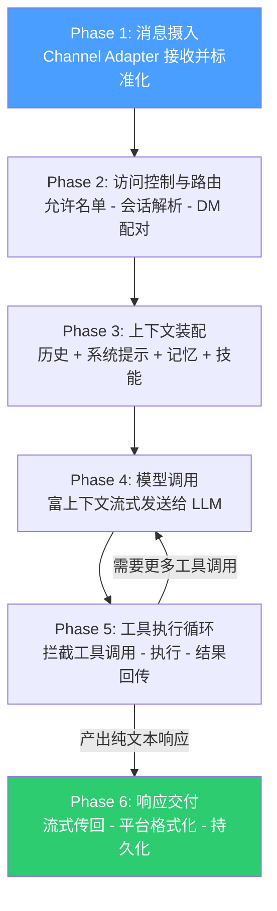

---
tags:
  - OpenClaw
  - 架构
  - agent-loop
aliases:
  - Agent Flow Loop
  - Agent-Flow-Loop
  - 执行循环
  - Agent Execution Loop
---

# Agent Execution Loop

Agent Execution Loop 是 [[OpenClaw 是什么|OpenClaw]] 的核心工作机制——每条用户消息触发的 6 阶段处理流程。它实现了从消息接收到响应交付的完整自主决策循环。

## 6 阶段流程



### Phase 1: Ingestion（消息摄入）
Channel Adapter 接收并标准化消息。

### Phase 2: Access Control & Routing（访问控制与路由）
允许名单验证 -> 会话解析 -> DM 配对检查。

### Phase 3: Context Assembly（上下文装配）
加载会话历史 -> 组合系统提示 -> 搜索相关[[记忆系统|记忆]] -> 注入技能。这是[[上下文管理机制]]的核心阶段。

### Phase 4: Model Invocation（模型调用）
将富上下文流式发送给配置的 LLM。

### Phase 5: Tool Execution Loop（工具执行循环）
拦截模型的工具调用 -> 执行（可能在 Docker 沙箱中）-> 结果回传。**重复直到模型产出纯文本响应（无更多工具调用）**。这是 [[Tool Use 机制]]的实际运行阶段。

### Phase 6: Response Delivery（响应交付）
响应流式传回 Adapter -> 平台格式化 -> 发送 -> 状态持久化。

## 典型延迟

访问控制 <10ms + 会话加载 <50ms + 提示装配 <100ms + 首 Token 200-500ms + 工具执行 100ms-3s

## 与 Claude Code 的区别

| 特性 | OpenClaw Agent Loop | Claude Code Loop |
|------|-------------------|-----------------|
| 运行模式 | 24/7 持续运行 | 会话制，用完即关 |
| 界面 | 聊天应用（WhatsApp 等） | 终端 / IDE |
| 记忆 | 跨会话持久记忆 + 向量检索 | 会话内上下文 + Compaction |
| 工具范围 | 文件、浏览器、邮件、日历、智能家居 | 代码编辑、终端、Git |
| 沙箱 | Docker 容器（可选） | 内置沙箱 |
| 自我修正 | 有限 | 强（SWE-bench 80.8%） |

## 底层运行时：Pi Agent Core

Pi Agent Core 是 OpenClaw 的底层 Agent 运行时引擎，由 Mario Zechner（libGDX 游戏引擎作者）开发。它采用 TypeScript 编写，运行在 npm 生态系统之上。

### Message Pipeline

```
AgentMessage[] -> transformContext() -> convertToLlm() -> LLM Provider
```

1. **AgentMessage[]**：原始消息数组
2. **transformContext()**：上下文变换——注入记忆、裁剪历史、应用 Pruning
3. **convertToLlm()**：转换为特定 LLM Provider 的格式
4. **LLM Provider**：发送给模型并接收流式响应

### Steering 机制

- **`steer()`**：中断当前执行——立即停止正在进行的 Agent 循环，插入新指令（抢占式控制）
- **`followUp()`**：排队等待——将新指令加入队列，等当前循环完成后再执行（协作式控制）

## 后续演进

v2026.4.2 引入 **Durable TaskFlow**，将 Agent Execution Loop 从单次对话扩展为跨会话的持久化工作流。v2026.6.2 改进了 Agent 和 CLI 运行时从中断的工具调用中的恢复能力，以及压缩交接（compaction handoff）的恢复机制。详见 [[OpenClaw v2026.4 版本更新]] 和 [[OpenClaw v2026.6 版本更新]]。

## 相关笔记

- [[Agent-Flow-Loop 原理]]
- [[Lane-Based Queuing 并发模型]]
- [[Heartbeat 主动监控机制]]
- [[OpenClaw v2026.4 版本更新]] — Durable TaskFlow
- [[OpenClaw v2026.6 版本更新]] — 运行时恢复改进

## 参考

- [OpenClaw GitHub](https://github.com/anthropics/openclawx)
- [Anthropic 官网](https://anthropic.com)
