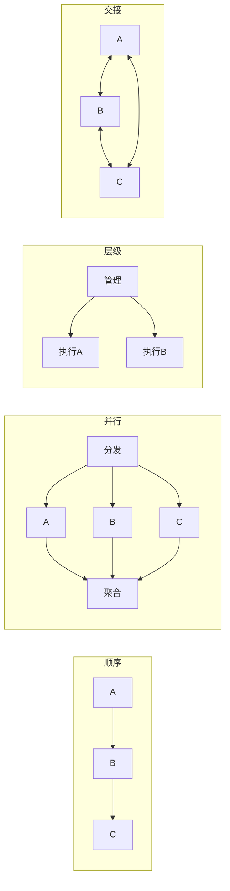

# Agent 编排模式

## 一句话理解

> 一个Agent就像一个员工——简单任务一个人够了。但复杂任务需要一个团队，关键问题是：**这个团队怎么协作？** 是流水线、各干各的、还是有个经理统一调度？这就是编排模式要解决的问题。

## 单Agent vs 多Agent

**单Agent**：一个模型 + 多个工具，适合相对简单的任务。但当工具和知识源太多时，提示词变得臃肿，性能下降。

**多Agent**：将复杂任务分解给多个专精Agent，每个Agent职责清晰。优势在于：
- **专业化**：每个Agent聚焦一个领域，提示词更精简
- **可扩展**：增删Agent不需要重新设计整个系统
- **可维护**：单独测试和调试某个Agent

## 四种核心编排模式

### 1. 顺序编排（Pipeline）
任务沿固定路径从一个Agent传到下一个，像工厂流水线。适合有明确依赖关系的工作流。

### 2. 并行编排（Fan-out/Fan-in）
多个Agent同时处理同一任务的不同方面，最后合并结果。适合独立子任务的快速处理。

### 3. 层级编排（Hierarchical）
上级Agent负责规划和分配，下级Agent负责执行。像公司管理结构，适合大规模企业级自动化。

### 4. 交接编排（Handoff）
Agent之间动态转交任务，无需中央调度。每个Agent判断自己能不能处理，不能就转给合适的Agent。

## 编排模式对比

## 反馈回路（Self-Correction）

第五种值得关注的模式：一个Agent的输出由另一个"审查Agent"检查。比如代码生成Agent写完代码后，安全审查Agent检查漏洞，事实检查Agent验证数据。这能显著减少幻觉。

## OpenClaw的编排策略

OpenClaw采用的是**层级+交接的混合模式**：
- 主Agent作为任务规划者和协调者
- 子Agent（如代码执行、网页浏览、文件操作）各司其职
- 通过 [[Agent Execution Loop]] 实现任务的迭代和自我修正
- 借助 [[Lane-Based Queuing 并发模型]] 管理并行任务的资源分配

## 2026年市场前景

- 自主AI Agent市场预计2026年达85亿美元，2030年达350亿美元
- Deloitte预测：更好的编排可使市场规模再增15%-30%
- [[MCP 协议]] 正成为Agent间通信的标准协议

## 后续发展

v2026.4.2 引入 **Durable TaskFlow** 编排层，使多步工作流具备状态持久化和跨重启恢复能力，详见 [[OpenClaw v2026.4 版本更新]]。v2026.6.1 的 **Workboard 编排原语** 则在 UI 层面落地了多 Agent 编排——让非开发者也能可视化地编排多 Agent 工作流，详见 [[OpenClaw v2026.6 版本更新]]。

## 双链导航

- [[多Agent协作架构]] — 多Agent系统的技术细节
- [[Agent Execution Loop]] — 单个Agent内部的执行循环
- [[Lane-Based Queuing 并发模型]] — OpenClaw的并发资源管理
- [[OpenClaw v2026.4 版本更新]] — Durable TaskFlow 编排层
- [[OpenClaw v2026.6 版本更新]] — Workboard 编排原语
- [[Dynamic Workflows]] — 动态工作流概念

## 参考

- [OpenClaw GitHub](https://github.com/anthropics/openclawx)
- [MCP 规范](https://modelcontextprotocol.io)
