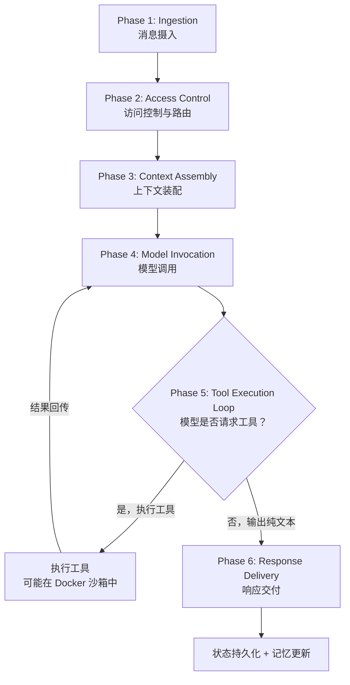

---
tags:
  - OpenClaw
  - 核心架构
  - agent-loop
  - 执行循环
aliases:
  - Agent Flow Loop
  - Agent Execution Loop
  - 执行循环原理
  - 核心循环
---

# Agent-Flow-Loop 原理

## 一句话理解

想象一个超级秘书坐在办公桌前：有人递来一张纸条（消息），秘书先确认来者身份（访问控制），然后翻阅记忆本回忆相关背景（上下文装配），再打电话问专家意见（模型调用），如果专家说"帮我查个数据"就去查（工具执行），最后把答案写好递回去（响应交付）。这就是 Agent-Flow-Loop——每条消息触发的**完整处理循环**。

## 为什么叫 "Loop"？

关键在 Phase 5：模型可能说"我需要先查个东西"，于是系统执行工具、把结果喂回模型、模型再判断……直到模型输出纯文本（不再需要工具），循环才结束。这就是自主决策循环的核心——Agent 自行判断何时需要更多信息，何时可以给出最终答案。就像秘书和专家之间的多轮电话：

> 专家："帮我查一下日历" → 秘书查了 → 专家："再查一下邮件" → 秘书查了 → 专家："好，告诉用户明天下午 3 点有会"

## 六阶段流程



### Phase 1: Ingestion（消息摄入）

Channel Adapter（如 WhatsApp Baileys、Telegram grammY）接收用户消息，将平台特定格式转换为 OpenClaw 内部统一格式。就像翻译官——不管你说英语、法语还是中文，翻译官都转成同一种"内部语言"。

### Phase 2: Access Control & Routing（访问控制与路由）

消息路由系统执行三步验证：
1. **允许名单验证**：你在白名单上吗？
2. **会话解析**：你属于哪个 Agent、哪个会话？
3. **DM 配对检查**：陌生人需要输入配对码才能和 Agent 对话

这是 Agent 的"门卫"——没有通行证就进不去。

### Phase 3: Context Assembly（上下文装配）

这是最精妙的阶段，[[上下文管理机制]]按顺序组装一个"超级提示词"：

```
1. IDENTITY.md / AGENTS.md  → 核心指令（不可违反的规则）
2. SOUL.md                  → 人格/语气
3. TOOLS.md                 → 用户特定约定
4. Skills（选择性注入）      → 仅注入相关技能，避免 Token 膨胀
5. Memory 搜索结果           → 语义相关的历史上下文
6. 工具定义                  → 自动从内置工具和插件注册生成
```

[[记忆系统]]在这里发挥关键作用——通过**混合搜索**（70% 向量语义 + 30% BM25 关键词）找到相关历史记忆，让 Agent 像一个"记得你所有偏好的老朋友"。

### Phase 4: Model Invocation（模型调用）

将装配好的富上下文流式发送给 LLM。OpenClaw 支持多个 Provider：Anthropic、OpenAI、Ollama、DeepSeek 等。流式传输意味着用户不需要等整个回复生成完——就像对方在实时打字。

### Phase 5: Tool Execution Loop（核心循环）

**这是整个 Loop 的灵魂。** 模型可能返回一个工具调用请求（而非纯文本），此时：

1. 系统拦截工具调用请求
2. 在合适环境中执行（宿主机或 Docker 沙箱）
3. 将执行结果回传给模型
4. 模型决定：继续调用工具，还是输出最终回复？
5. **循环直到模型产出纯文本**

类比：你问秘书"帮我订明天的机票"，秘书可能需要：查日历（工具1）→ 查航班（工具2）→ 对比价格（工具3）→ 最终回复"已订好东航 MU5137"。

### Phase 6: Response Delivery（响应交付）

回复流式传回 Channel Adapter，进行平台特定格式化（Markdown 样式、消息分块、媒体上传），然后发送给用户。最后进行状态持久化——记忆更新、会话历史保存。

## 典型延迟分析

| 阶段 | 耗时 |
|------|------|
| 访问控制 | <10ms |
| 会话加载 | <50ms |
| 提示装配 | <100ms |
| 首 Token 延迟 | 200-500ms |
| 工具执行 | 100ms-3s/次 |

总体来说，用户发消息后 **0.5-1 秒**就能看到 Agent 开始回复。

## 与 Claude Code 的关键区别

| 特性 | OpenClaw Agent Loop | Claude Code Loop |
|------|-------------------|-----------------|
| 运行模式 | 24/7 持续运行 | 会话制，用完即关 |
| 界面 | 聊天应用（WhatsApp 等） | 终端 / IDE |
| 记忆 | 跨会话持久记忆 + 向量检索 | 会话内上下文 + Compaction |
| 工具范围 | 文件、浏览器、邮件、日历、智能家居 | 代码编辑、终端、Git |
| 沙箱 | Docker 容器（可选） | 内置沙箱 |

详细对比见 [[OpenClaw vs Claude Code]]。

## 并发控制：Lane-Based Queuing

当多条消息同时到达时，[[Lane-Based Queuing 并发模型]] 保证一致性：

- **单写者规则**：每个会话同一时间只有一个 Agent 运行实例
- **Per-Session Lane**：保证会话内消息有序
- **Global Lane**：全局并发控制（默认最多 10 个并行）
- **Steer 模式**：用户可以在 tool boundary 优雅地抢占执行方向

## 记忆系统如何融入循环

三层记忆在循环的不同阶段发挥作用：

1. **Context Assembly 阶段**：搜索相关记忆注入上下文
2. **Tool Execution 阶段**：Agent 可能主动调用记忆写入工具
3. **Response Delivery 阶段**：会话历史自动持久化
4. **Compaction 触发时**：执行 Pre-Compaction Memory Flush——Agent 先把重要信息"抢救"到 MEMORY.md，再压缩旧对话

> 这个 "临终遗言" 机制是 Meta AI 安全总监邮箱事件的直接教训——Compaction 过程曾意外删除安全指令。

## Heartbeat：让循环主动运转

[[Heartbeat 主动监控机制]] 让 Agent 不只是被动等待消息，而是按计划主动触发 Agent Execution Loop：

```
定时器触发 → 读取 HEARTBEAT.md → 执行标准 Agent Loop → 评估是否需要告警
```

> Cron 是机械执行，Heartbeat 是带判断力的检查。

## 自我修改能力

最具争议的设计：Agent 可以在 Tool Execution 阶段修改自己的源代码——Skill 文件、系统提示模板、甚至工具实现。修改后 **250ms 内**自动热重载。

这意味着 Agent Loop 不只是执行指令，它还能**进化自身**。详见 Agent 范式转变。

## 核心洞察

Agent-Flow-Loop 的设计哲学可以用一句话概括：

> "OpenClaw treats AI as an infrastructure problem. The LLM provides intelligence; OpenClaw provides the operating system."

LLM 只是"大脑"，OpenClaw 提供了"身体"——感知（Channel）、记忆（Memory）、动手能力（Tools）、安全感（Sandbox）。这就是为什么 OpenClaw 不是技术突破，而是**工程突破**——它让 AI Agent 从实验室走进了普通人的聊天窗口。

## 后续演进：Durable TaskFlow

v2026.4.2 引入了 **Durable TaskFlow**，让 Agent-Flow-Loop 从"单次对话内的循环"扩展为"跨会话、跨重启的持久化工作流"。TaskFlow 维护独立的 owner session、return context 和 revision tracking，使编排逻辑可以脱离单次对话存活。v2026.4.7 进一步加入 Webhook 触发机制，把 OpenClaw 从"需要人类发起的对话系统"变成"可以被事件驱动的自动化平台"。详见 [[OpenClaw v2026.4 版本更新]]。

## 相关笔记

- [[Agent Execution Loop]] - 执行循环的具体实现
- [[Tool Use 机制]] - 工具调用机制
- [[OpenClaw v2026.4 版本更新]] — Durable TaskFlow 编排层
- [[Agent 编排模式]] — 多步工作流编排范式

## 参考

- [OpenClaw GitHub](https://github.com/anthropics/openclawx)
- [Anthropic 官网](https://anthropic.com)
