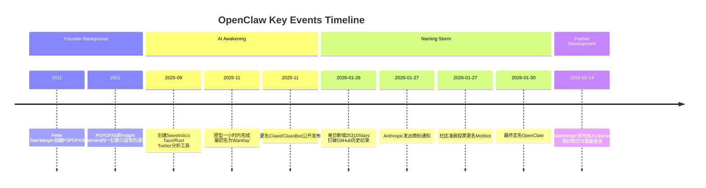

---
tags:
  - OpenClaw
  - 历史
  - 创始人
aliases:
  - OpenClaw 历史
  - OpenClaw 时间线
  - Peter Steinberger
---

# OpenClaw 的起源与发展历程

## 创始人

由 [[Peter Steinberger]] 创建——奥地利开发者，PSPDFKit 前创始人。

## 诞生

原型在**一小时内**完成（[[Vibe Coding]] 的极致体现），这是 Steinberger 自 2009 年以来的第 44 个 AI 相关项目。月服务器费用亏损约 $10,000。项目使用 TypeScript 开发，发布于 npm。

## 命名风波时间线

完整名称演变：**Warelay** -> **Clawd** -> **Clawdbot** -> **Moltbot** -> **OpenClaw**

| 时间 | 事件 |
|------|------|
| 2025年11月（原型） | 最初名为 Warelay（WhatsApp Relay 的缩写） |
| 2025年11月（公开发布） | 更名为 Clawd / Clawdbot 公开发布 |
| 2026年1月27日 | Anthropic 发出商标通知（"Clawd" 与 "Claude" 过于相似，参见 [[OpenClaw 与 Anthropic 关系]]） |
| 改名间隙 | $CLAWD 加密骗局事件：旧社交账号被诈骗团伙抢注，伪造"官方治理代币"，市值一度飙至 $1600 万后崩盘归零 |
| 2026年1月27-29日 | 社区凌晨 5 点 Discord 投票更名为 Moltbot（龙虾蜕壳之意） |
| 2026年1月30日 | 因发音困难最终定名 OpenClaw |

### "The Great Molt"混乱

- Twitter 改名后**几秒内**机器人抢注 @openclaw 发布加密钱包骗局
- Steinberger 意外改了自己的 GitHub 个人账户名而非组织名，需要 GitHub SVP 介入恢复
- AI 生成的"Handsome Molty"恐怖图像被加密骗子武器化为 meme

最终迁移在 **3 小时内**由社区核心成员通宵协作完成。

### 外界反应

- **DHH**（Ruby on Rails 创建者）公开批评 Anthropic 的行为是 "customer hostile"
- OpenClaw 是 Anthropic Claude API 最大的付费流量来源之一，商标执法反而将 Steinberger 推向了 OpenAI

## 增长轨迹

- 第 1 天：5,000 stars
- 第 3 天：60,000+ stars
- 2026年1月26日：单日新增 25,310 stars，**打破 GitHub 历史纪录**
- 84 天：从 9K 增长到 200,000 stars（比 Kubernetes 快 18 倍）

这一增长速度创造了开源项目的历史记录，也推动了生态系统的快速形成。项目基于 MIT License 发布，体现了编程民主化的理念。

## 现状

2026年2月14日，Steinberger 宣布加入 OpenAI，项目转交独立[[OpenClaw Foundation 治理|开源基金会]]。商业模式仍为完全免费开源。

2026年3月，[[OpenClaw v2026.3 版本更新|v2026.3 系列版本]]完成了历史遗留的技术清理——v2026.3.22-beta.1 移除所有旧版 `CLAWDBOT_*` 和 `MOLTBOT_*` 环境变量，统一为 `OPENCLAW_*`，标志着改名事件的技术影响最终消除。

2026年4-6月，OpenClaw 经历了"能力建设→稳定化→治理"三阶段演进：[[OpenClaw v2026.4 版本更新|v2026.4]] 引入 Durable TaskFlow 和 Memory-Wiki 完成"持久化运行时"转型，[[OpenClaw v2026.5 版本更新|v2026.5]] 密集修复稳定性，[[OpenClaw v2026.6 版本更新|v2026.6]] 引入 Auto Mode 和 [[Operator Install Policy]] 建设企业级治理能力。值得注意的是，Codex OOTH 路由的深度集成时间线与 Steinberger 加入 OpenAI 高度吻合。

## 相关笔记

- [[OpenClaw 是什么]]
- [[OpenClaw v2026.3 版本更新]] — v2026.3.22-beta.1 清理了改名遗留的环境变量
- [[OpenClaw v2026.4 版本更新]] — 持久化运行时转型
- [[OpenClaw v2026.5 版本更新]] — 稳定化窗口
- [[OpenClaw v2026.6 版本更新]] — 企业级治理能力
- [[Peter Steinberger]]
- [[OpenClaw 与 Anthropic 关系]]
- [[CI CD 流水线]] — 项目从原型到社区协作过程中的持续集成实践

## 参考

- [OpenClaw GitHub](https://github.com/anthropics/openclawx)
- [Anthropic 官网](https://anthropic.com)
