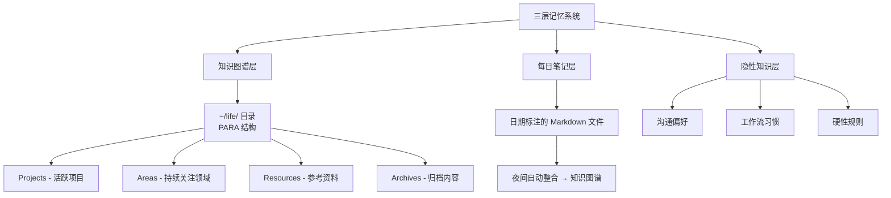

---
tags:
  - 概念
  - 记忆系统
  - PARA
aliases:
  - 记忆系统
  - PARA记忆
---

# 三层记忆系统

三层记忆系统是 [[案例-Nat Eliason 的 AI 创业实验]] 中 Agent "Felix" 使用的记忆架构，使 Agent 具备持久的上下文理解能力。

**一句话总结**：三层记忆系统让 AI Agent 从"每次对话都是陌生人"进化为"了解你一切偏好的长期搭档"，核心思路是把人类知识管理方法论（PARA）嫁接到 Agent 的持久化存储上。数据存储后端使用 [[SQLite]]，检索则结合 [[向量嵌入与混合搜索]] 技术。

## 三层结构详解

### 第一层：知识图谱层（长期记忆）

基于 **PARA 系统**（Projects / Areas / Resources / Archives），存储在 `~/life/` 目录中。这是 Tiago Forte 的第二大脑方法论在 Agent 中的实践：

- **Projects**：当前活跃项目——Felix 正在运营的网站、信息产品等
- **Areas**：持续关注的领域——创业、营销、内容策略
- **Resources**：参考资料——市场调研数据、竞品分析
- **Archives**：已完成或搁置的项目

Nat Eliason 的 Agent "Felix" 在 3 周内赚取 **$14,718**，核心原因之一就是知识图谱层让 Felix 能够积累对市场和客户的理解，而不是每次从零开始。

### 第二层：每日笔记层（工作记忆）

日期标注的 Markdown 文件，记录日常交互和发现。关键机制是 **夜间自动整合**：

1. 白天的交互、发现、决策记录在当日笔记中
2. 每晚自动将有价值的内容提取、归类到知识图谱对应的 PARA 节点
3. 类似人类睡眠时的记忆巩固——短期记忆转化为长期记忆

这解决了 Agent 最大的痛点之一：**[[上下文管理机制|上下文窗口]]有限**。即使对话被截断，关键信息已经持久化。

### 第三层：隐性知识层（人格记忆）

存储沟通偏好、工作流习惯、硬性规则——这些是难以显式编码但对协作至关重要的信息：

- "老板喜欢简洁的汇报风格，不要超过 3 个要点"
- "周五下午不安排重要决策"
- "与客户沟通时用正式语气，内部沟通可以随意"

这一层让 Agent 从"工具"变成了"了解你的同事"，与 [[System Prompt 设计]] 中的 SOUL.md 人格定义形成互补。

## 核心洞察

1. **记忆是 Agent 自主性的基础设施**——没有持久记忆的 Agent 就是一个高级聊天机器人，每次对话都在重复同样的"自我介绍"
2. **PARA 不是唯一选择，但它验证了结构化记忆的必要性**——无结构的日志堆积会导致检索失效，人类几十年积累的知识管理方法论可以直接复用
3. **隐性知识层是差异化的关键**——前两层可以用向量数据库+RAG 替代，但"理解你的沟通偏好"这一层需要长期交互的积累
4. **夜间整合机制是关键创新**——它解决了"信息过载 vs 持久化"的矛盾，类似人类的睡眠记忆巩固
5. **Felix 的成功数据验证了记忆系统的 ROI**——$1,000 → $14,718（3 周），运营速度 $4,000/周，没有记忆系统不可能实现这种持续增长

## 失败案例的反面验证

[[案例-Summer Yue 邮件删除灾难]] 中，[[上下文管理机制|上下文窗口压缩]]（context compaction）导致关键指令"等我确认后再操作"丢失，Agent 自主删除 200+ 封邮件。这恰好说明：**当记忆系统不可靠时，Agent 的自主性会从资产变成负债**。

## 后续演进：Memory-Wiki（四层记忆）

v2026.4.7 引入了 **Memory-Wiki**，在三层记忆系统基础上新增第四层——永久性结构化知识存储。与前三层不同，Memory-Wiki 采用声明-证据-矛盾检测模型，每条记忆条目追踪来源（观察/用户确认/模型推断/转录导入）及其可信度。v2026.4.29 进一步扩展为 People-Aware Memory，支持人物别名、关系图谱和来源视图。详见 [[OpenClaw v2026.4 版本更新]]。

## 与其他概念的关系

- [[上下文管理机制]]：记忆系统与上下文管理互为补充
- [[OpenClaw v2026.4 版本更新]]：Memory-Wiki 四层记忆的引入

> 来源：[Creator Economy - Nat Eliason](https://creatoreconomy.so/p/use-openclaw-to-build-a-business-that-runs-itself-nat-eliason)
