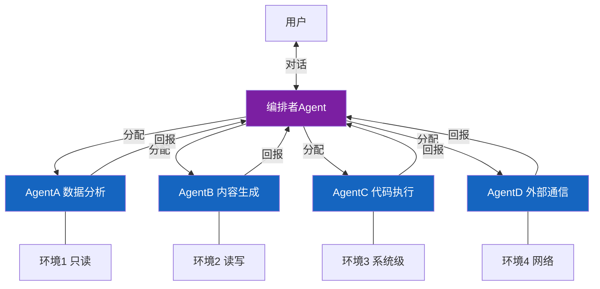

---
tags:
  - 概念
  - 架构
  - 多Agent
aliases:
  - 多Agent架构
  - Agent协作
  - 编排架构
---

# 多Agent协作架构

![[assets/multi-agent.jpg]]

多Agent协作架构是指多个 [[OpenClaw 是什么|OpenClaw]] Agent 通过分工和通信协同完成复杂任务的系统设计模式。这是 Agentic AI 发展到一定阶段的必然产物。

## 核心模式

- **编排者模式**：一个主 Agent 分配任务给专业化子 Agent，体现了 [[Agent 编排模式]] 的核心思想
- **物理隔离**：每个 Agent 运行在独立环境中，防止跨污染，利用 Docker 容器或独立硬件
- **权限分级**：不同 Agent 拥有不同的系统访问权限

## 编排者模式架构图

## 典型案例

| 案例 | Agent 数量 | 编排方式 |
|------|-----------|---------|
| [[案例-Jesse Genet 家庭教育系统]] | 5 | 物理隔离（独立 Mac Mini） |
| [[案例-MFS Corp 零人类员工 AI 公司]] | 6 | Morgan 作为参谋长编排 |
| [[案例-14个Agent协作系统]] | 14+ | Opus 4.5 作为编排者 |
| [[案例-三个 AI 人格深度评测]] | 3 | 专业化人格分工 |

## 安全考量

多 Agent 系统的安全风险比单 Agent 更复杂。Jesse Genet 的物理隔离方案是目前最稳健的做法，但也带来更高的成本。

## 后续发展

v2026.4.2 的 **Durable TaskFlow** 让多 Agent 编排具备了状态持久化和跨重启恢复能力。v2026.6.1 的 **Workboard 编排原语** 在 UI 层面落地了多 Agent 编排——支持多 Agent 计划和运行追踪、任务评论集成，让非开发者也能可视化地编排多 Agent 工作流。详见 [[OpenClaw v2026.4 版本更新]] 和 [[OpenClaw v2026.6 版本更新]]。

## 相关笔记

- [[Agent 编排模式]]
- [[安全边界与风险（总览）]]
- [[OpenClaw v2026.4 版本更新]] — Durable TaskFlow
- [[OpenClaw v2026.6 版本更新]] — Workboard 编排原语

## 参考

- [OpenClaw GitHub](https://github.com/anthropics/openclawx)
- [Anthropic 官网](https://anthropic.com)
