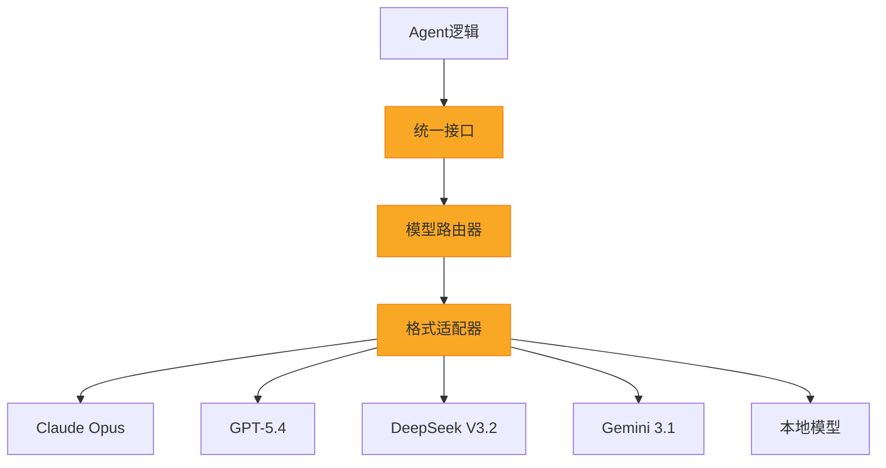

# 模型无关架构

![[assets/model-agnostic.jpg]]

> **一句话本质：** 模型无关架构就是在 AI 应用和具体大模型之间加一层"翻译官"——应用只说"标准语言"，翻译官负责对接不同模型的"方言"，这样换模型就像换电池，不用重新造设备。

## 为什么重要

1. **避免厂商锁定（Vendor Lock-in）**：2026年模型格局半年一变，今天最强的明天可能被超越。绑死一个模型 = 绑死一个厂商的定价、政策和技术路线。
2. **成本优化**：不同任务适合不同模型——简单分类用 Haiku，复杂推理用 Opus，批量处理用 DeepSeek。模型无关架构让你按需选型。
3. **风险分散**：API 宕机、政策变更、地缘封锁……单一依赖是系统性风险。但模型无关也意味着任何模型都能被注入——这正是 [[致命三合一安全矛盾]] 的技术根源：当架构对所有模型一视同仁，攻击面也随之扩展到所有模型。
4. **竞争优势**：新模型发布后，最快集成的团队获得先发优势。

## 架构设计模式

### 三层架构详解

**应用层**：Agent 的业务逻辑、任务规划、工具调用。完全不感知底层用的是哪个模型。

**抽象层**（核心）：
- **统一接口（Unified API）**：标准化输入输出格式——消息结构、工具定义、流式响应
- **模型路由器（Model Router）**：根据任务类型、成本预算、延迟要求自动选择最优模型
- **格式适配器（Format Adapter）**：将统一格式转换为各模型的私有 API 格式（如 Claude 的 `tool_use` vs GPT 的 `function_calling`）

**模型层**：具体的 LLM 提供商，可以是云端 API，也可以是本地部署。

## OpenClaw 如何实现模型无关

[[OpenClaw 是什么]] 的模型无关设计体现在：

1. **Provider 插件系统**：每个模型提供商是一个独立插件，实现统一的 `LLMProvider` 接口。v2026.3.12 起，Ollama、vLLM、SGLang 等已迁移到 [[Provider-Plugin 架构]]，让模型接入从"PR 合并"变成"npm install"
2. **配置驱动切换**：通过配置文件或环境变量指定模型，无需修改 Agent 代码
3. **[[MCP 协议]] 标准化工具调用**：工具定义与模型无关，所有模型共享同一套工具生态
4. **Fallback 链**：主模型失败时自动降级到备选模型，保证 Agent 可用性

### 6 种提供商热切换（v2026.4）

v2026.4 的 Provider Manifest 架构使得以下 6 类提供商可以在运行时无需重建即可切换：GPT-5.5 via Codex（OOTH 路由）、Claude API（Anthropic 直连）、Gemini（Google AI）、DeepSeek（V4 Flash/Pro）、OpenRouter（聚合路由）、Ollama/LM Studio/Gemma 4（本地模型）。[[OpenClaw v2026.4 版本更新|Durable TaskFlow]] 使热切换真正可行——工作流有独立的持久化身份，模型切换不会中断进行中的 Flow。v2026.4.29 还新增了 NVIDIA 提供商和模型目录。

## 实践建议

- **不要过早优化**：先用一个模型跑通流程，验证业务价值后再引入多模型路由
- **统一 prompt 模板**：不同模型对 prompt 的敏感度不同，维护模型特定的 prompt 变体
- **监控与评测**：建立跨模型的质量评测基准，用数据驱动模型选择
- **成本追踪**：按模型、按任务类型记录 token 消耗，定期优化路由策略

## 延伸阅读

- [[OpenClaw 是什么]] — 模型无关架构的实践案例
- [[Provider-Plugin 架构]] — v2026.3 引入的模型提供商插件化架构，是模型无关的工程落地
- [[OpenClaw v2026.4 版本更新]] — 6 种提供商热切换与 DeepSeek V4 默认化
- [[Dashboard 控制面板]] — Config 模块管理 Provider 配置
- [[MCP 协议]] — 标准化工具调用的协议层
- [[API 定价与成本分析]] — 多模型路由的成本优化
- [[竞品成本对比]] — 不同配置的成本对比
- [[Agent Execution Loop]] — Agent 执行中的模型调用
- [[Cloudflare Workers]] — 边缘部署场景下的模型无关实践
- [[工程整合范式]] — 模型无关架构是工程整合的核心设计模式之一

## 参考

- [OpenClaw GitHub](https://github.com/anthropics/openclawx)
- [MCP 规范](https://modelcontextprotocol.io)
