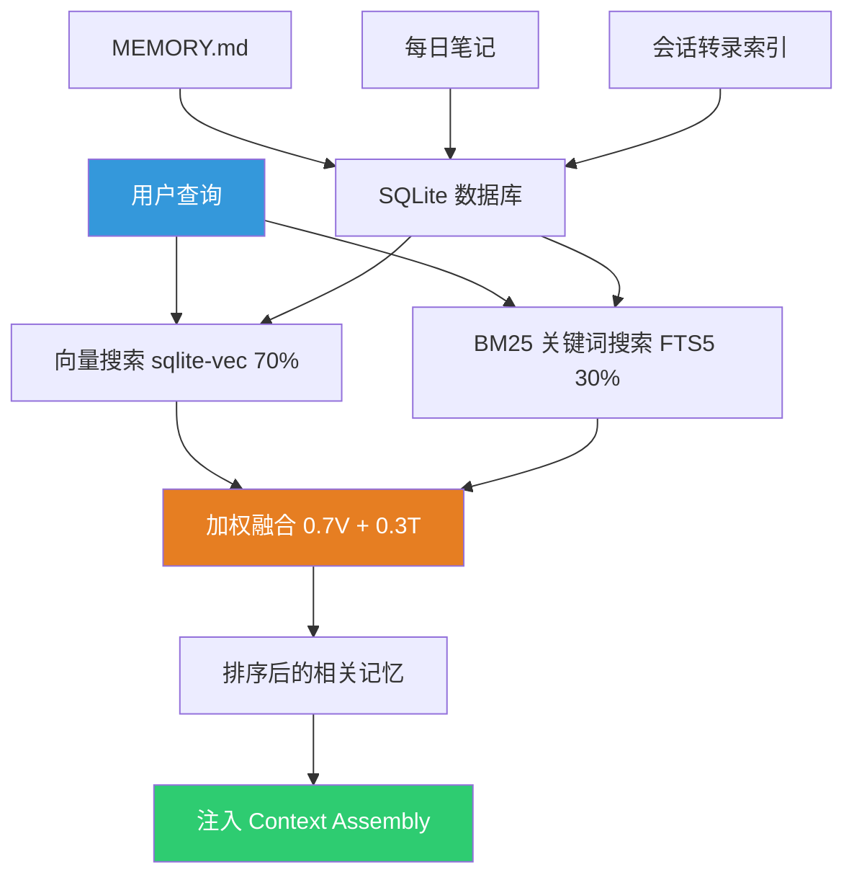

---
tags:
  - 架构
  - 记忆
  - OpenClaw
aliases:
  - Memory
  - 记忆系统
  - Memory Architecture
---

# 记忆系统

记忆系统是 OpenClaw 最核心的差异化能力之一。它让 Agent 从"一次性工具"进化为拥有持久身份的"助理"。

## 混合搜索架构

使用 SQLite + 向量嵌入（`~/.openclaw/memory/<agentId>.sqlite`）：

- **向量相似度搜索（70% 权重）**：语义匹配相关的历史对话
- **BM25 关键词搜索（30% 权重）**：精确的 Token 匹配

评分公式：`finalScore = vectorWeight * vectorScore + textWeight * textScore`

技术实现使用 sqlite-vec 扩展存储向量，FTS5 实现 BM25 关键词搜索。

## 记忆层级结构

1. **MEMORY.md**：策划的稳定事实（仅主会话可写，保护隐私）
2. **每日笔记** `memory/YYYY-MM-DD.md`：运行中的活动日志
3. **会话转录索引**：可选的全历史可搜索性
4. **Memory-Wiki**（v2026.4.7 引入）：永久性结构化知识存储，采用声明-证据-矛盾检测模型，详见 [[OpenClaw v2026.4 版本更新]]

v2026.4.29 进一步引入 **People-Aware Memory**，为频繁交互的人物建立结构化档案，支持人物别名、关系图谱和来源视图。

## 与上下文管理的关系

记忆搜索结果在 [[Agent Execution Loop]] 的 Phase 3（Context Assembly）中被注入到系统提示中。Compaction 执行前会触发 Pre-Compaction Memory Flush，将重要信息保存到 MEMORY.md。

## 与 Claude Code 的对比

- **OpenClaw**：跨会话持久记忆 + 向量检索，Agent 可以"记住"用户的偏好、历史对话和重要事实
- **Claude Code**：仅会话内上下文 + Compaction，每次新会话从零开始

## 隐私与安全

MEMORY.md 仅主会话可写，防止其他会话篡改核心记忆。但记忆系统也带来安全风险——持久记忆可能被注入恶意指令。

## 相关笔记

- [[上下文管理机制]]
- [[Agent Execution Loop]]
- [[会话状态管理|会话管理]]
- [[向量嵌入与混合搜索]]
- [[OpenClaw 是什么]]
- [[OpenClaw v2026.4 版本更新]] — Memory-Wiki 与 People-Aware Memory 引入
- [[可插拔记忆插件]] — 记忆后端可插拔化

## 参考

- [OpenClaw GitHub](https://github.com/anthropics/openclawx)
- [sqlite-vec - SQLite 向量扩展](https://github.com/asg017/sqlite-vec)
