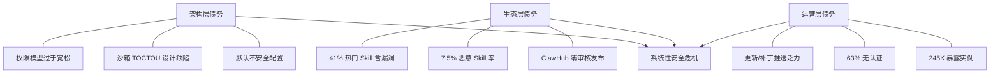

---
tags:
  - 安全
  - 总览
  - OpenClaw
  - CVE
  - 安全态势
  - 2026Q2
aliases:
  - Q2 安全总览
  - 2026 Q2 安全
  - OpenClaw 安全态势 Q2
  - 安全债务分析
---

# 2026年Q2安全态势总览

**时间范围**：2026 年 4 月 — 6 月 | **最后更新**：2026 年 6 月

## 一句话理解

> 2026 年 Q2 是 OpenClaw 安全形势最严峻的季度：CVE 累计突破 472 个、Claw Chain 四漏洞链影响 24.5 万实例、41% 热门 Skill 含漏洞、Google 首次确认 AI 生成零日用于实战——安全债务全面爆发。

## 关键安全指标仪表盘

| 指标 | 数值 | 趋势 |
|------|------|------|
| 累计 CVE 数量 | **472+**（截至 2026-05） | 持续攀升，平均每天 2.7 个 |
| CVSS 9.0+ 漏洞 | **5+**（含 9.9 双杀） | 频率加快 |
| 公网暴露实例 | **~245,000**（Shodan ~65K + ZoomEye ~180K） | 较 Q1 增长约 80% |
| 无认证实例占比 | **63%** | 无明显改善 |
| ClawHub 恶意 Skill | **1,103**（全量 14,706 中占 7.5%） | 全量审计后首次量化 |
| 热门 Skill 漏洞率 | **41.7%** | 首次独立审计确认 |
| AI 生成零日攻击 | **首次确认** | 从理论到实战的转折 |

## Q2 重大安全事件时间线

```
2026-04-06  CVE 累计突破 138 个（63 天内新增 137 个 advisory）
2026-04-23  OpenClaw v2026.4.22 发布，修复 Claw Chain 四漏洞
2026-05-11  GTIG 发布 AI 生成零日报告，首次确认 AI 武器化
2026-05-18  Cyera 公开 Claw Chain 技术细节
2026-05     ClawSecure 发布热门 Skill 审计：41.7% 含漏洞
2026-05     RankClaw 全量审计结果：7.5% 恶意率
2026-05     公网暴露实例突破 245,000
```

## CVE-2026-28447：插件安装路径穿越漏洞

### 漏洞概要

| 属性 | 值 |
|------|-----|
| **CVE** | CVE-2026-28447 |
| **CVSS** | 7.0（High） |
| **CWE** | 路径穿越 |
| **影响版本** | 2026.1.29-beta.1 ~ 2026.2.1 |
| **GHSA** | GHSA-qrq5-wjgg-rvqw |

### 技术细节

OpenClaw 的插件安装器从 `package.json` 的 `name` 字段派生安装目录路径，但未对路径穿越序列（`..`）进行充分验证。攻击者可以构造包含穿越序列的 scoped package name，使 `path.join` 操作产生指向 extensions 目录之外的路径。

```
正常安装路径：
  ~/.openclaw/extensions/@scope/plugin-name/

恶意包名构造：
  name: "@scope/../../.openclaw/config"
  → path.join(extensionsDir, "../../.openclaw/config")
  → 实际写入 ~/.openclaw/config → 覆盖应用配置
```

**影响**：攻击者可覆盖 OpenClaw 状态目录（`~/.openclaw/`）中的配置文件，改变应用行为，为后续攻击铺路。

**修复**（v2026.2.1）：验证插件 ID 合法性，确保解析后的安装路径始终在 extensions 基础目录内。

### 与其他漏洞的关系

CVE-2026-28447 虽然严重度（CVSS 7.0）低于 [[Claw Chain 四漏洞链|Claw Chain]] 的顶级漏洞，但它代表了另一类攻击面：**不需要进入沙箱，直接在安装阶段就能控制宿主**。这与 [[恶意 Skills 供应链攻击]] 形成互补——恶意 Skill 可以同时利用内容级（运行时）和安装级（路径穿越）两条攻击路径。

## 公网暴露实例的持续增长

### 暴露规模对比

| 时间 | Shodan | ZoomEye | 其他来源 | 备注 |
|------|--------|---------|----------|------|
| 2026-01 | ~21,000 | — | Censys: 21,639 | 初始测量 |
| 2026-02 | — | — | STRIKE: 40,214 → 135,000+ | 快速增长期 |
| 2026-02 | — | — | Maor Dayan: 42,665 | 独立验证 |
| 2026-05 | **~65,000** | **~180,000** | 合计: ~245,000 | Q2 峰值 |

从 2026 年 1 月的约 21,000 到 5 月的约 245,000，公网暴露实例在 **4 个月内增长了 11.7 倍**。

### 增长驱动因素

1. **OpenClaw 用户基数爆发**：AI Agent 热潮推动的部署量激增
2. **默认配置不安全**：早期版本默认绑定 `0.0.0.0:18789`，后续版本虽改进但存量实例未更新
3. **云部署无防护**：大量部署在阿里云、Tencent Cloud 等公有云上，未配置安全组规则
4. **认证形同虚设**：63% 实例无认证，93.4% 存在认证绕过条件

### 行业分布风险

暴露实例涉及**金融、医疗、法律、政府、保险**等敏感行业，部分关联到 **Fortune 500 企业和美国政府组织**。这些场景下 Agent 工作流处理 PII、PHI 或特权凭证，暴露的后果远超普通 Web 服务。

详见 [[大规模实例暴露]] 和 [[暴露实例地理与云平台分布]]。

## CVE 累积态势

### 关键统计

| 指标 | 数值 |
|------|------|
| 累计 CVE（至 2026-04-06） | **138+**（至 2026-05 已达 472+） |
| 新增速率 | 每 **15 小时** 1 个 advisory |
| High/Critical 占比 | **41%** |
| CVSS 9.9 漏洞 | 2 个（CVE-2026-22172, CVE-2026-32922） |
| 首次正式审计发现 | 512 个漏洞，8 个 Critical（2026-01-25） |

### 最严重的 CVE

| CVE | CVSS | 类型 | 影响 |
|-----|------|------|------|
| CVE-2026-22172 | **9.9** | 认证绕过 | 无凭证获取管理员控制 |
| CVE-2026-32922 | **9.9** | 权限提升 | 配对 token 一步变管理员 + RCE |
| CVE-2026-44112 | **9.6** | TOCTOU 沙箱逃逸 | [[Claw Chain 四漏洞链\|Claw Chain]] 核心 |
| CVE-2026-25253 | **8.8** | WebSocket RCE | [[ClawJacked 远程代码执行漏洞\|一键 RCE]] |

CVE-2026-32922 被安全公司 ARMO 称为"OpenClaw 历史上最严重的漏洞"——单个 API 调用即可将配对 token 转化为完整的管理员权限和 RCE 能力。

### CVE 增长轨迹

Joel Gamblin 维护的公开跟踪器 **jgamblin/OpenClawCVEs** 记录了 137 个安全 advisory，时间跨度仅 **63 天**（2026-02-02 至 2026-04-04）。这意味着平均每天 2.2 个新漏洞，速率在开源项目中几乎前所未见。

## 41% 热门 Skill 含安全漏洞

### ClawSecure 审计

2026 年 5 月，安全公司 ClawSecure 对 ClawHub 上 **2,890 个热门 Skill**（从 awesome-openclaw-skills 列表和 openclaw/skills 官方仓库抽取）进行了迄今最大规模的公开安全分析。

| 指标 | 数值 |
|------|------|
| 审计 Skill 总量 | **2,890** |
| 含漏洞比率 | **41.7%** |
| High/Critical 漏洞 Skill | **30.6%**（883 个） |
| Critical 发现数 | **1,587** |
| High 发现数 | **1,205** |
| ClawHavoc 关联指标 | **18.7%** 展现内存收割或 C2 回调行为 |

eSecurity Planet 以此为题发表了专题报道，标题直言"超过 41% 的热门 OpenClaw Skill 存在安全漏洞"。

### 漏洞类型

审计发现的漏洞类型与 Agent 架构紧密相关：
- **命令注入**：Skill 通过构造恶意命令在宿主机执行
- **数据外泄**：将 Agent 上下文中的敏感信息发送到外部
- **凭证收割**：窃取环境变量中的密钥和 Token
- **Prompt Injection**：通过隐藏指令劫持 Agent 行为

## 整体安全债务分析

### 安全债务的三层结构



**架构层**：OpenClaw 的安全模型存在根本性设计问题。[[致命三合一安全矛盾]] 并未因补丁而消失——Agent 仍需高权限执行任务、仍处理不受信任的内容、仍依赖用户决策。Claw Chain 四漏洞链证明沙箱并非万能屏障。

**生态层**：ClawHub 的安全治理速度远落后于 Skill 增长。VirusTotal 集成是进步，但 [[RankClaw ClawHub 审计|RankClaw 审计]] 和 ClawSecure 审计证明检测盲区巨大。

**运营层**：24.5 万暴露实例中 63% 无认证，且涉及金融、医疗等敏感行业。补丁发布后，存量实例的更新推进缓慢——很多部署是"装了就忘"模式。

### 债务的累积效应

| 时间点 | 关键事件 | 安全债务状态 |
|--------|----------|------------|
| 2026-01 | 首次正式审计：512 漏洞 | 债务曝光 |
| 2026-02 | ClawHavoc、ClawJacked、ToxicSkills | 多线并发危机 |
| 2026-03 | v2026.3.22 大版本发布 | 部分偿还 + 新增功能引入新风险 |
| 2026-04 | Claw Chain 修复、CVE 突破 138 | 偿还速度追不上增长 |
| 2026-05 | GTIG AI 零日确认、ClawSecure 41% | 威胁维度质变（AI 武器化） |

### 与同类项目的对比

472 个 CVE 在不到 6 个月内——这一密度在开源项目中极为罕见。仅 4 月初的 63 天内就新增了 137 个 advisory，截至 5 月更突破 472 个。相比之下，Kubernetes 在同等成熟度阶段的 CVE 密度约为 OpenClaw 的 1/10。这反映的不仅是"发现得多"，更是**架构安全投入长期不足**的后果。

## Q3 展望与风险预判

1. **公网暴露仍将增长**：AI Agent 的部署需求不会因安全问题放缓，245K 大概率在 Q3 突破 300K
2. **AI 生成攻击将常态化**：GTIG 报告打开了潘多拉盒子，更多攻击者会效仿 APT45 的 AI 辅助漏洞挖掘模式
3. **监管压力加大**：[[监管层面动态]] 表明多国政府已关注到 AI Agent 安全问题
4. **行业整合可能性**：安全厂商对 OpenClaw 的密集研究可能催生专门的 Agent 安全赛道

## 相关笔记

- [[Claw Chain 四漏洞链]]
- [[GTIG AI 生成零日攻击报告]]
- [[RankClaw ClawHub 审计]]
- [[ClawJacked 远程代码执行漏洞]]
- [[大规模实例暴露]]
- [[暴露实例地理与云平台分布]]
- [[恶意 Skills 供应链攻击]]
- [[Snyk ToxicSkills 研究报告]]
- [[ClawHub 安全整改措施]]
- [[致命三合一安全矛盾]]
- [[安全边界与风险（总览）]]
- [[AI Agent 安全态势 2026]]
- [[监管层面动态]]
- [[安全厂商评估汇总]]

## 外部链接

- [BetterClaw - OpenClaw Security 2026: 138 CVEs](https://www.betterclaw.io/blog/openclaw-security-2026)
- [Blink Blog - Complete CVE Timeline](https://blink.new/blog/openclaw-2026-cve-complete-timeline-security-history)
- [GitHub - jgamblin/OpenClawCVEs](https://github.com/jgamblin/OpenClawCVEs/)
- [eSecurity Planet - 41% Skills Vulnerabilities](https://www.esecurityplanet.com/threats/over-41-of-popular-openclaw-skills-found-to-contain-security-vulnerabilities/)
- [ARMO - CVE-2026-32922 Analysis](https://www.armosec.io/blog/cve-2026-32922-openclaw-privilege-escalation-cloud-security/)
- [NVD - CVE-2026-28447](https://nvd.nist.gov/vuln/detail/CVE-2026-28447)
- [Sangfor - OpenClaw Security Risks](https://www.sangfor.com/blog/cybersecurity/openclaw-ai-agent-security-risks-2026)
