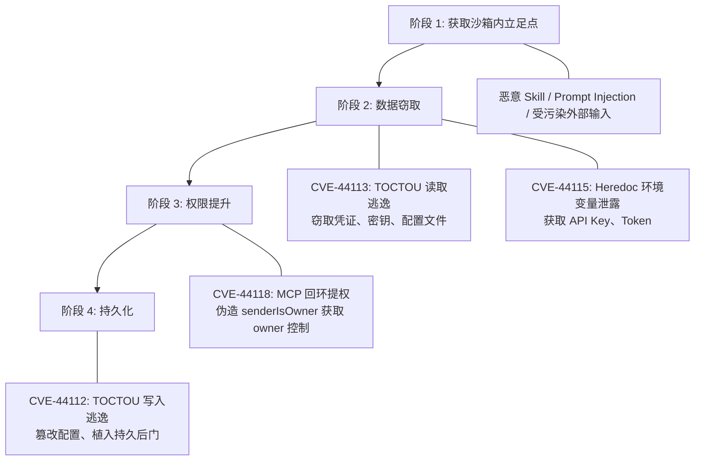

---
tags:
  - 安全
  - 漏洞
  - CVE
  - 沙箱逃逸
  - TOCTOU
  - OpenClaw
  - Cyera
aliases:
  - Claw Chain
  - 四漏洞链
  - CVE-2026-44112
  - CVE-2026-44113
  - CVE-2026-44115
  - CVE-2026-44118
  - OpenClaw 沙箱逃逸
---

# Claw Chain 四漏洞链

**CVE-2026-44112 / 44113 / 44115 / 44118** | CVSS 最高 9.6 | 2026-05-18 披露

## 一句话理解

> 四个独立漏洞像链条一样精密咬合：从沙箱内的一个立足点出发，逐步完成数据窃取、权限提升、持久后门植入——最终完全接管宿主机。这是 2026 年 OpenClaw 遭遇的最严重安全事件。

## 事件概要

2026 年 5 月 18 日，网络安全公司 [[Cyera Research 与 Claw Chain 披露|Cyera]] 的安全研究员 **Vladimir Tokarev** 公开披露了四个可链式利用的 [[OpenClaw 是什么|OpenClaw]] 漏洞，统称 **"Claw Chain"**。Shodan 与 ZoomEye 扫描显示约 **245,000 个公开可达的 OpenClaw 实例**受影响，使其成为 OpenClaw 历史上影响范围最广的漏洞组合。

OpenClaw 于 2026 年 4 月 23 日发布 v2026.4.22 修复了全部四个漏洞。Cyera 遵循负责任披露流程，在补丁就绪后才公开技术细节。

## 四个漏洞详解

### CVE-2026-44112：OpenShell TOCTOU 写入沙箱逃逸

| 属性 | 值 |
|------|-----|
| **CVSS** | **9.6（Critical）** |
| **CWE** | CWE-367（Time-of-Check Time-of-Use） |
| **组件** | OpenShell 沙箱文件系统桥接层 |
| **GHSA** | GHSA-5h3g-6xhh-rg6p |

**技术原理**：OpenShell 在执行沙箱内的写入操作时，先验证目标路径的规范位置是否在挂载根（mount root）内，然后才实际打开文件写入。攻击者在沙箱内控制一个符号链接（symlink），利用验证与写入之间的微小时间窗口，将 symlink 指向挂载根之外的路径。

```
时间线：
  T1: 沙箱验证 → /sandbox/mount/target → ✓ 在 mount root 内
  T2: 攻击者竞态交换 symlink → /sandbox/mount/target → /host/etc/config
  T3: 沙箱执行写入 → 实际写入 /host/etc/config → 逃逸成功
```

**影响**：攻击者可向宿主机任意路径写入文件，为后续植入后门和篡改配置奠定基础。这是整条链的最终"落锤"——用于实现持久化。

### CVE-2026-44113：OpenShell TOCTOU 读取沙箱逃逸

| 属性 | 值 |
|------|-----|
| **CVSS** | **7.7（High）** |
| **CWE** | CWE-367（Time-of-Check Time-of-Use） |
| **组件** | OpenShell 沙箱文件系统桥接层 |
| **GHSA** | GHSA-wppj-c6mr-83jj |

**技术原理**：与 CVE-2026-44112 对称的读取侧漏洞。同样的 TOCTOU 竞态模式，攻击者在路径验证通过后、实际读取文件前，交换 symlink 使其指向沙箱外的敏感文件。

**影响**：攻击者可读取宿主机上的凭证、密钥、配置文件等敏感数据，为后续的权限提升提供必要的认证信息。

### CVE-2026-44115：Heredoc 环境变量泄露

| 属性 | 值 |
|------|-----|
| **CVSS** | **8.8（High）** |
| **CWE** | CWE-184（Incomplete List of Disallowed Inputs） |
| **组件** | 命令验证与 shell 执行层 |
| **GHSA** | GHSA-r6xh-pqhr-v4xh |

**技术原理**：OpenClaw 的命令允许列表（allowlist）在验证阶段会检查用户提交的命令是否安全。然而，攻击者可以在 **heredoc** 主体中嵌入 shell 扩展标记（如 `$ENV_VAR`）。验证器将 heredoc 视为纯文本字符串，但 shell 在实际执行时会展开这些变量——包括存储了 API 密钥、Token 等敏感信息的环境变量。

```bash
# 验证阶段看到的：一个无害的 cat 命令
cat <<EOF
$OPENAI_API_KEY
$DATABASE_URL
$SECRET_TOKEN
EOF
# 执行阶段：shell 展开变量，敏感值直接输出
```

**影响**：绕过命令允许列表验证，泄露运行时环境变量中的所有凭证和密钥。

### CVE-2026-44118：MCP 回环非 Owner 提权

| 属性 | 值 |
|------|-----|
| **CVSS** | **8.2（High）** |
| **CWE** | CWE-863（Incorrect Authorization） |
| **组件** | MCP 回环运行时 |
| **GHSA** | GHSA-x3h8-jrgh-p8jx |

**技术原理**：OpenClaw 在处理请求时信任客户端自行声明的 `senderIsOwner` 标志，而不对照已认证的会话进行验证。任何持有有效 bearer token 的本地进程，都可以在请求中设置 `senderIsOwner: true`，从而将自身提升为 owner 级别权限。

**影响**：获取 owner 权限意味着控制网关配置、cron 调度、执行环境管理——相当于掌控了整个 Agent 实例。

**修复方案**：分离 owner 与 non-owner 的 bearer token，`senderIsOwner` 改为从认证 token 中派生，而非从可伪造的请求头读取。

## 完整攻击链



```
恶意输入进入沙箱
  → CVE-44113 + CVE-44115 窃取凭证和环境变量
    → CVE-44118 利用窃取的 Token 伪造 owner 身份
      → CVE-44112 向宿主机写入后门 → 完全控制
```

每个漏洞单独来看危害有限，但链式组合后实现了从"沙箱内受限执行"到"宿主机完全控制"的完整 kill chain。这种精密的链式利用正是"Claw Chain"命名的由来。

## 影响规模

| 指标 | 数值 |
|------|------|
| Shodan 发现实例 | ~65,000 |
| ZoomEye 发现实例 | ~180,000 |
| 合计公开暴露 | **~245,000** |
| 受影响版本 | v2026.4.22 之前的所有版本 |
| 高风险行业 | 金融、医疗、法律 |

相较于此前 [[ClawJacked 远程代码执行漏洞]] 影响的约 15,200 个实例，Claw Chain 的影响面扩大了 **16 倍**，反映了 OpenClaw 部署量在 2026 年的爆发式增长，也是 [[大规模实例暴露]] 问题的最新佐证。

## 修复与响应

| 时间 | 事件 |
|------|------|
| 2026 年 4 月 | Cyera 向 OpenClaw 维护者报告漏洞 |
| 2026-04-23 | OpenClaw v2026.4.22 发布，修复全部四个 CVE |
| 2026-05-18 | Cyera 公开发布技术细节 |

修复措施包括：
- 引入规范目标验证，在实际 I/O 前对 mount root 进行二次校验
- 拒绝不安全的 symlink 父级和叶级 symlink
- 使用 root-scoped 写入辅助函数，在同步到远程沙箱前重新验证
- 分离 owner/non-owner bearer token
- heredoc 主体中禁止未引用的变量扩展

## 安全启示

1. **TOCTOU 是沙箱的天敌**：任何"先检查后执行"的设计在竞态条件下都可能被绕过。[[沙箱机制]] 的安全性取决于其最弱环节
2. **信任边界必须明确**：`senderIsOwner` 从客户端读取是典型的"信任不该信任的输入"错误
3. **防御应按链条思考**：单个 CVSS 7.7 的漏洞看似可控，但链式组合后 CVSS 接近 10.0。安全评估不能只看单点
4. **AI Agent 特有风险**：初始立足点可以通过 [[Prompt Injection 风险|Prompt Injection]] 或 [[恶意 Skills 供应链攻击|恶意 Skill]] 获取，无需传统意义上的"初始入侵"

## 相关笔记

- [[Cyera Research 与 Claw Chain 披露]]
- [[沙箱机制]]
- [[ClawJacked 远程代码执行漏洞]]
- [[大规模实例暴露]]
- [[权限控制机制]]
- [[代码执行安全]]
- [[恶意 Skills 供应链攻击]]
- [[2026年Q2安全态势总览]]
- [[安全边界与风险（总览）]]

## 外部链接

- [Cyera Blog - Claw Chain 原始披露](https://www.cyera.com/blog/claw-chain-cyera-research-unveil-four-chainable-vulnerabilities-in-openclaw)
- [The Hacker News - Four OpenClaw Flaws](https://thehackernews.com/2026/05/four-openclaw-flaws-enable-data-theft.html)
- [SecurityWeek - Claw Chain](https://www.securityweek.com/claw-chain-openclaw-flaws-allow-sandbox-escape-backdoor-delivery/)
- [CSA Lab Space - 分析报告](https://labs.cloudsecurityalliance.org/research/csa-research-note-openclaw-claw-chain-sandbox-escape-2026051/)
- [CybersecurityNews - 245,000 Exposed Servers](https://cybersecuritynews.com/openclaw-chain-vulnerabilities/)
