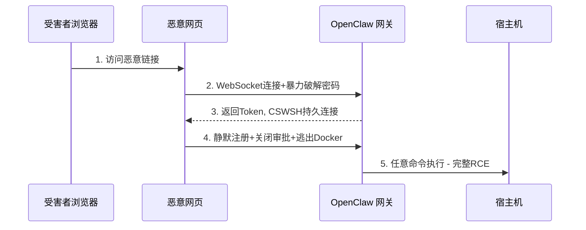

---
tags:
  - 安全
  - 漏洞
  - RCE
  - CVE
  - OpenClaw
aliases:
  - CVE-2026-25253
  - ClawJacked
  - 一键RCE
---

# ClawJacked 远程代码执行漏洞

**CVE-2026-25253** | CVSS 8.8 | CWE-669

由 Oasis Security 研究团队披露，影响 v2026.1.29 之前的版本。该漏洞是 OpenClaw 面临的最严重安全威胁之一。

## 攻击原理

攻击者通过恶意链接利用**跨站 WebSocket 劫持（CSWSH）**窃取认证令牌。即使 OpenClaw 绑定到 localhost，攻击仍可通过受害者浏览器发起。这正是 [[致命三合一安全矛盾]] 中"处理不受信任内容"风险的极端体现。

## 完整 Kill Chain



```
受害者访问恶意页面
  → 页面JavaScript向localhost发起WebSocket连接（绕过同源策略）
    → 暴力破解网关密码（localhost豁免速率限制，数百次/秒）
      → 窃取认证Token
        → CSWSH建立持久连接
          → 静默注册为受信任设备（localhost自动批准，无用户提示）
            → 完全控制网关 → 任意命令执行
```

## 权限提升路径

利用被盗 Token 的 `operator.admin` 和 `operator.approvals` 作用域：

1. 通过 API 设置 `exec.approvals.set` = `off` → **关闭所有用户确认提示**
2. 设置 `tools.exec.host` = `gateway` → **强制命令在宿主机执行，逃出 Docker 容器**
3. 最终：一次浏览器点击 → 宿主机完整 RCE

**约 15,200 个暴露实例**存在此 RCE 风险（2026 年 2 月数据，占当时部署的 35.4%），详见 [[大规模实例暴露]]。后续 [[Claw Chain 四漏洞链]] 披露时暴露实例已增至 **245,000+**。该漏洞也成为安全厂商对 OpenClaw 安全评估的重要案例，并引发了监管层面的关注。

> Diana Kelley（Noma Security CISO）："核心问题是对本地连接的错误信任。'本地'并不自动意味着'安全'。"

## 修复

OpenClaw 团队在 **24 小时内**完成协调披露与修复（v2026.2.25+），实施了 **TOFU（Trust On First Use）策略**和 **Origin 头验证**。

NVD 完整向量：`CVSS:3.1/AV:N/AC:L/PR:N/UI:R/S:U/C:H/I:H/A:H`

## 相关笔记

- [[致命三合一安全矛盾]]
- [[大规模实例暴露]]
- [[权限控制机制]]
- [[代码执行安全]]
- [[Claw Chain 四漏洞链]] — 后续更严重的链式漏洞
- [[2026年Q2安全态势总览]] — CVE 累积态势

## 外部链接

- [CVE-2026-25253 - NVD](https://nvd.nist.gov/vuln/detail/CVE-2026-25253)
- [Sophos AI Security Report](https://sophos.com)
