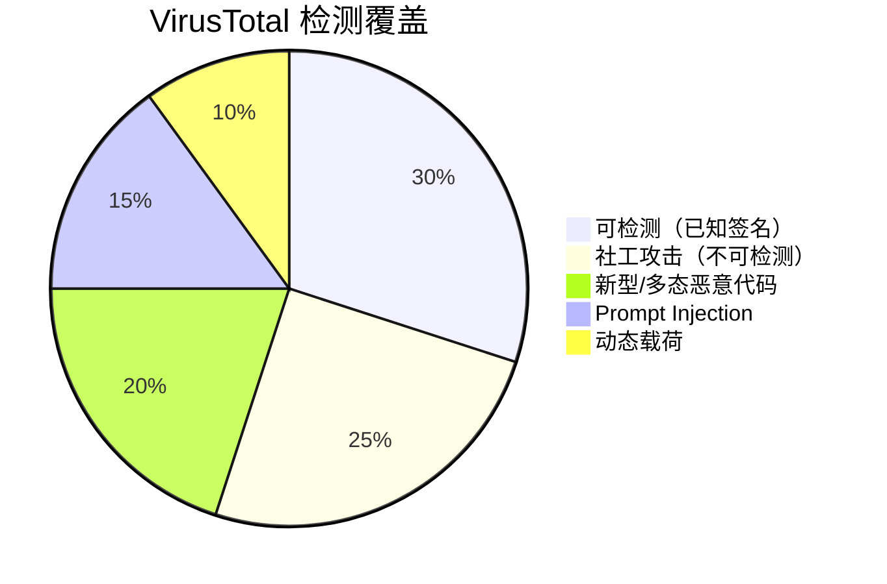

---
tags:
  - 安全
  - 供应链攻击
  - Skills
  - ClawHub
  - 审计
  - OpenClaw
aliases:
  - RankClaw 审计
  - ClawHub 全量审计
  - RankClaw 安全审计
  - ClawHub 7.5% 恶意率
---

# RankClaw ClawHub 审计


![[assets/rankclaw-audit.jpg]]

**审计方**：RankClaw | **范围**：ClawHub 全量注册表 | **样本量**：14,706 个 Skills

## 一句话理解

> RankClaw 对 ClawHub 全量 14,706 个 Skill 进行了迄今最大规模的安全审计，发现 1,103 个恶意 Skill（7.5%）。更令人警醒的是，OpenClaw 事后引入的 VirusTotal 扫描只能捕获已知签名，大量社工类和新型攻击仍在检测盲区内。

## 审计核心数据

| 指标 | 数值 |
|------|------|
| 总扫描 Skills 数量 | **14,706** |
| 发现恶意 Skills | **1,103** |
| 恶意比率 | **7.5%** |
| 此前 Koi Security 抽样发现 | 341（较小样本集） |
| Snyk ToxicSkills 发现漏洞率 | 36.82%（3,984 样本中） |
| ClawSecure 热门 Skill 漏洞率 | 41.7%（2,890 个热门 Skill） |

RankClaw 的审计在规模上远超此前的安全研究：

```
Koi Security: 抽样审计 → 341 个恶意 Skill
Snyk ToxicSkills: 3,984 个样本 → 1,467 个有漏洞（36.82%）
RankClaw: 全量 14,706 → 1,103 个恶意（7.5%）
ClawSecure: 2,890 个热门 Skill → 41.7% 有漏洞
```

## 恶意 Skill 的类型分布

RankClaw 审计揭示的恶意行为涵盖多个攻击类别：

| 攻击类型 | 说明 | 危害等级 |
|----------|------|----------|
| 命令注入 | Skill 中嵌入隐藏 shell 命令 | Critical |
| 凭证窃取 | 收集环境变量中的 API Key/Token | Critical |
| 数据外泄 | 将本地数据发送到外部 C2 服务器 | High |
| 后门安装 | 下载并执行额外载荷 | Critical |
| Prompt Injection | 通过隐藏指令操控 Agent 行为 | High |
| 内存收割 | 提取 Agent 上下文中的敏感信息 | High |

## VirusTotal 扫描的检测盲区

OpenClaw 在 [[ClawHub 安全整改措施|ClawHavoc 事件]] 后与 VirusTotal 合作，对所有新提交的 Skill 进行自动化扫描。但 RankClaw 的审计暴露了这一防线的系统性局限：

### 能力边界



### 五大检测盲区

**1. 已知签名依赖**

VirusTotal 本质上是一个多引擎签名匹配平台。它擅长检测已知恶意软件家族，但对**全新的、AI 生成的恶意代码**无能为力。正如 [[GTIG AI 生成零日攻击报告]] 所揭示的，国家级行为者已经在用 AI 生成定制化攻击代码。

> OpenClaw 维护者自己也承认 VirusTotal 扫描"不是银弹"（not a silver bullet）。

**2. 社会工程攻击**

[[Atomic Stealer 通过 ClawHub 分发|ClawHavoc 攻击]] 的主要载体是虚假的"前置条件"shell 命令——诱骗用户在安装前手动执行恶意命令。这类社工攻击不涉及恶意代码文件，**没有任何自动化扫描器能捕获**。

**3. Prompt Injection 载荷**

恶意 Skill 可以通过精心构造的 Prompt 操控 Agent 行为，使其执行数据外泄或权限滥用。这些载荷是自然语言文本，不是二进制代码，完全不在传统杀毒引擎的扫描范围内。

**4. 动态加载内容**

Skill 可以在运行时从远程 URL 下载并执行代码。静态扫描时 Skill 本身是干净的，恶意行为在运行时才触发。

**5. 低引擎覆盖率**

即使是已知恶意软件，VirusTotal 的检出率也不乐观。[[Atomic Stealer 通过 ClawHub 分发|Atomic Stealer (AMOS)]] 的原始二进制在 VirusTotal 上仅被 **16/~70 个引擎** 识别——不到 23% 的检出率。

## 与其他安全研究的对比

| 研究 | 样本量 | 发现 | 时间 |
|------|--------|------|------|
| **Koi Security** | 抽样 | 341 恶意 Skill | 2026-02 |
| **Snyk ToxicSkills** | 3,984 | 36.82% 有漏洞；341 恶意 | 2026-02 |
| **RankClaw** | **14,706** | **1,103 恶意（7.5%）** | 2026 Q1-Q2 |
| **ClawSecure** | 2,890 热门 | 41.7% 有漏洞 | 2026-05 |

多个独立研究从不同角度验证了同一结论：**ClawHub 生态系统存在严重的安全治理缺失**。

值得注意的差异：RankClaw 的全量审计发现的恶意率（7.5%）低于 Snyk 抽样审计中的感染率（12%）。这可能因为全量扫描包含了大量低流量的无害 Skill，拉低了整体比率。但 7.5% 的绝对数字——意味着每安装 13 个 Skill 就有 1 个是恶意的——依然触目惊心。

## 安全治理建议

RankClaw 审计的核心教训是：**技术防线（VirusTotal）只是必要条件，不是充分条件**。

| 层级 | 当前状态 | 需要改进 |
|------|----------|----------|
| 自动化扫描 | VirusTotal 签名匹配 | 引入行为分析、沙箱动态检测 |
| 发布审核 | 仅需 1 周 GitHub 账号 | 提高发布门槛，引入代码审查 |
| 运行时防护 | 无 | Skill 行为监控、异常检测 |
| 社区治理 | 开放式市场 | 分级信任模型、Skill 签名 |
| 企业使用 | 直接从 ClawHub 安装 | 内部安全审计后才允许部署 |

## 对 OpenClaw 生态的影响

RankClaw 的审计结果迫使 OpenClaw 社区正视一个残酷现实：ClawHub 的增长速度远远超过了安全治理的跟进速度。当 [[Skills 市场]] 的规模从数百增长到近 15,000 时，安全机制仍停留在"零审核 + 事后补救"的阶段。

这种**安全债务**的累积，加上 [[GTIG AI 生成零日攻击报告|AI 生成攻击的实战化]]，使得 ClawHub 正在成为 AI Agent 时代的安全重灾区。

## 与传统包管理器供应链攻击的对比

ClawHub 的安全困境并非孤例——npm、PyPI、RubyGems 都经历过供应链攻击。但 AI Agent Skill 市场有其独特的风险放大因素：

| 维度 | npm/PyPI | ClawHub |
|------|----------|---------|
| 执行权限 | 应用级，受 OS 权限限制 | Agent 级，天然高权限 |
| 用户审查意识 | 开发者通常会检查依赖 | 非技术用户直接安装 Skill |
| 自动化执行 | 需要代码调用 | Agent 自主决定何时调用 Skill |
| 攻击面 | 代码执行 | 代码执行 + Prompt Injection + 数据外泄 |
| 生态成熟度 | 有签名、审计、锁文件等机制 | 零审核，无签名，无锁机制 |
| 恶意包检测 | Socket.dev、Snyk 等工具成熟 | VirusTotal 签名扫描（有限） |

核心差异在于：传统包管理器中的恶意包需要开发者在代码中主动引用才会执行；而 ClawHub 中的恶意 Skill 可以通过 Agent 的自主决策被激活，用户甚至不知道哪个 Skill 正在运行。这使得**攻击的隐蔽性和触发概率都远高于传统供应链攻击**。

## RankClaw 审计方法论

RankClaw 采用了多层次的分析方法：

1. **静态分析**：扫描 Skill 代码中的已知恶意模式（shell 命令注入、外部 URL 调用、环境变量读取等）
2. **行为签名匹配**：与已知恶意 Skill 家族（如 ClawHavoc 变种）进行特征比对
3. **元数据分析**：检查发布者账号年龄、发布频率、命名模式（typosquatting 检测）
4. **依赖关系审查**：追踪 Skill 的外部依赖是否引入了恶意组件

这种全量审计的规模和深度在 AI Agent 安全领域开创了先例。

## 相关笔记

- [[恶意 Skills 供应链攻击]]
- [[Snyk ToxicSkills 研究报告]]
- [[Atomic Stealer 通过 ClawHub 分发]]
- [[ClawHub 安全整改措施]]
- [[GTIG AI 生成零日攻击报告]]
- [[Prompt Injection 风险]]
- [[2026年Q2安全态势总览]]
- [[安全边界与风险（总览）]]

## 外部链接

- [OpenClaw Blog - VirusTotal Partnership](https://openclaw.ai/blog/virustotal-partnership)
- [The Hacker News - OpenClaw VirusTotal Scanning](https://thehackernews.com/2026/02/openclaw-integrates-virustotal-scanning.html)
- [Penligent - ClawHub Supply-Chain Boundary](https://www.penligent.ai/hackinglabs/openclaw-virustotal-clawhub-skill-scanning-turns-the-marketplace-into-a-supply-chain-boundary/)
- [CyberPress - ClawHavoc 1,184 Malicious Skills](https://cyberpress.org/clawhavoc-poisons-openclaws-clawhub-with-1184-malicious-skills/)
