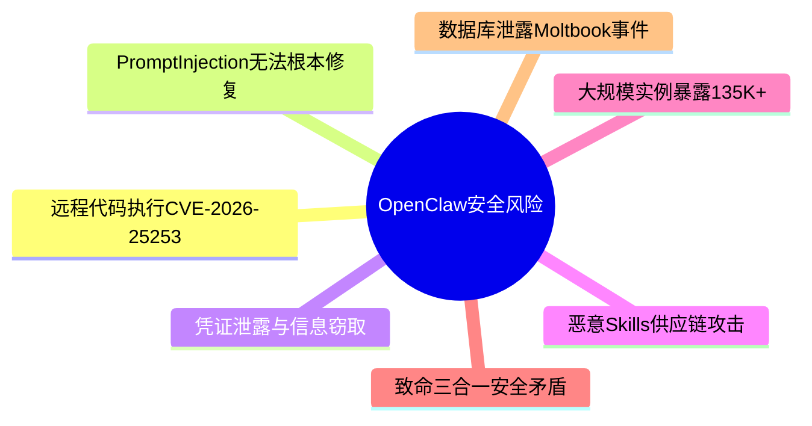

---
tags:
  - 安全
  - OpenClaw
  - 总览
  - AI-Agent
aliases:
  - OpenClaw安全风险总览
  - 安全边界总览
---

# 安全边界与风险（总览）

> "If you care about the security of your device or the privacy of your data, don't use OpenClaw. Period." —— Gary Marcus

[[OpenClaw 是什么|OpenClaw]] 被 Palo Alto Networks 称为 **"2026年最大的潜在内部威胁"**。根据 AI Agent 安全态势 2026，自主 AI Agent 的安全问题已上升为行业首要关注点。

## 核心风险类别



1. **[[ClawJacked 远程代码执行漏洞]]** — CVE-2026-25253，CVSS 8.8，一键 RCE
2. **[[Claw Chain 四漏洞链]]** — 四个 CVE 链式利用，CVSS 最高 9.6，影响 245K 实例
3. **[[Prompt Injection 风险]]** — 最根本性安全威胁，无法根本修复
4. **[[凭证泄露与信息窃取]]** — Infostealer 已将 OpenClaw 列为目标
5. **[[恶意 Skills 供应链攻击]]** — 36.82% 的 Skills 存在漏洞，[[RankClaw ClawHub 审计|全量审计]] 7.5% 恶意率
6. **[[大规模实例暴露]]** — **245,000+** 实例暴露在公网（截至 2026 年 5 月）
7. **[[致命三合一安全矛盾]]** — Sophos 提出的核心安全架构问题
8. **Moltbook 数据库泄露事件** — Supabase 配置错误导致数据全面暴露
9. **[[2026年3月安全公告汇总]]** — 10 个 GHSA 安全公告，含 CVSS 10.0 满分漏洞
10. **[[GTIG AI 生成零日攻击报告]]** — Google 首次确认 AI 生成零日用于实战
11. **[[2026年Q2安全态势总览]]** — CVE 累计突破 472 个，安全债务全面爆发

## 核心矛盾

```
安全性 ←────────────────→ 实用性

越多的访问权限 = 越有用 = 越危险
```

安全风险越大，但 [[编程民主化]] 的价值也越大——这是 OpenClaw 的核心矛盾。让非程序员也能驾驭 AI Agent，本身就要求赋予更多权限，而更多权限正是安全威胁的根源。

这就是 致命三合一安全矛盾 的根源——权限控制、沙箱和代码执行安全之间存在不可调和的张力。OpenClaw 没有引入新的风险类别，它放大了 Agentic AI 固有的风险。ClawHavoc 事件 是这些风险从理论走向现实的标志性案例。

## 相关笔记

- [[安全厂商评估汇总]]
- [[安全最佳实践]]
- [[ClawHavoc 事件]]
- [[OpenClaw 安全生态]] — OpenClaw 安全体系的全景视图
- [[暴露实例地理与云平台分布]] — 暴露实例的地理和云平台统计
- [[Scott Shambaugh 被 AI 攻击事件]] — 开发者遭 AI Agent 恶意攻击的真实案例
- [[2026年3月安全公告汇总]] — 2026年3月 GHSA 安全公告总表
- [[WebSocket 提权漏洞 GHSA-rqpp]] — CVSS 10.0 严重漏洞
- [[工作区插件自动加载 RCE]] — 供应链攻击本地化入口
- [[配对机制安全缺陷]] — 配对码重放与凭证泄露
- [[Claw Chain 四漏洞链]] — 2026 年 5 月最严重漏洞组合
- [[GTIG AI 生成零日攻击报告]] — AI 武器化从理论到实战
- [[RankClaw ClawHub 审计]] — ClawHub 全量安全审计
- [[2026年Q2安全态势总览]] — Q2 安全态势与 CVE 累积分析

## 外部链接

- [CVE-2026-25253 - NVD](https://nvd.nist.gov/vuln/detail/CVE-2026-25253)
- [Sophos AI Security](https://sophos.com)
