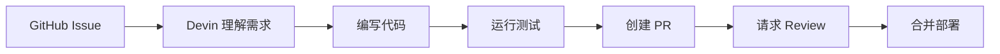

---
tags:
  - 竞品分析
  - Devin
  - 自主编码
aliases:
  - Devin
  - Cognition Devin
---

# Devin 分析

**一句话总结**：Devin 是 AI 世界的"远程软件工程师"——你给它一个 Issue，它自己写代码、测试、创建 PR 并部署，从 $500+/月降到 $20/月的价格战标志着自主编码工具正在从奢侈品变为日用品。

## 基本信息

| 维度 | 详情 |
|------|------|
| **类别** | 自主软件工程代理 |
| **公司** | Cognition Labs |
| **核心能力** | 写代码、修 Bug、创建 PR、部署 |
| **部署** | 云端 + 本地（Devin Desktop，原 Windsurf） |
| **费用** | ~~$500+/月~~ → **$20/月**起（Pro），ACU 按量计费 $2.25/ACU |
| **估值** | **$260 亿**（2026.5，Series D $10 亿+） |
| **ARR** | **$4.92 亿**（2026.5），同比增长 1,230% |
| **目标用户** | 工程团队（降价后扩展到个人开发者） |
| **运行模式** | 任务制——接收 Issue，交付 PR |
| **自写代码比例** | 自身代码库 **89%** 由 Devin 编写 |

## 技术架构与能力

Devin 代表的是完全自主路线，而 [[Agentic Engineering]] 认为人类编排才是正确方向——这是当前 AI 编码领域最根本的路线分歧。Devin 的核心设计理念是 **"AI 队友"而非"AI 工具"**：



1. **自主工作流**：接收一个 GitHub Issue → 理解需求 → 编写代码 → 运行测试 → 创建 PR → 请求 Review，体现了完整的执行循环
2. **云端执行**：所有代码在 Cognition 的服务器上运行，不需要本地环境（不同于 Claude Code 的本地运行模式）
3. **多步推理**：能够处理需要跨多个文件、理解项目架构的复杂任务
4. **Devin Wiki**（2.0 新增）：自动为代码库生成和维护文档，包括架构图、API 文档、变更日志——直接对标 Tech Lead 的知识管理职责

## 定位

Devin 是 **AI 软件工程师**，与 [[OpenClaw 是什么|OpenClaw]]（AI 私人助理）完全不同。

在行业最佳实践中的"六工具格局"：

```
写代码（终端）     → Claude Code
写代码（IDE）      → Cursor
Agent 指挥中心     → Devin Desktop（原 Windsurf，详见 [[Windsurf 更名 Devin Desktop]]）
快速原型           → Bolt
自主软件工程       → Devin  ← 这里
24/7 个人生活助理  → OpenClaw
```

## 最新动态（2026年3月）

- **大幅降价至 $20/月**：Cognition 将 Devin 从 $500+/月 降至 **$20/月**，与 Cursor 和 GitHub Copilot 价格持平。这标志着自主编码工具的价格战已经打响——当 [[Cursor Automations]] 以 $20/月提供类似的自主编码能力时，Devin 的高价策略难以为继
- **Devin 2.0 发布**：新版本大幅提升了代码理解能力和多文件协作能力，更加强调"端到端"工程能力——从理解需求到部署上线的全流程自主完成
- **Devin Wiki**：新增知识库功能，Devin 可以自动为代码库生成和维护文档 Wiki
- 在 Anthropic Agentic Coding 趋势报告的八大趋势中，Devin 的降价被视为"AI 编码工具从奢侈品变为日用品"的标志性事件

## 最新动态（2026年Q2）

- **$260 亿估值**：Cognition 完成 $10 亿+ Series D 融资，估值从 $102 亿（2025.9）翻倍至 $260 亿
- **ARR $4.92 亿**：年化收入从 $3700 万（2025.5）暴涨至 $4.92 亿，同比增长 1,230%
- **89% 代码自写**：Cognition 自身代码库中 89% 由 Devin 编写（2025.12 仅 13%）——"狗粮"验证的极致案例
- **Windsurf 更名 Devin Desktop**：2026.6.2 通过 OTA 更新完成品牌整合，Cascade 被 Rust 重写的 Devin Local 取代，默认界面变为 Agent Command Center（详见 [[Windsurf 更名 Devin Desktop]]）
- **SWE-1.6 自研模型**：发布专为软件工程优化的自研模型，成为模型+工具垂直整合的典范
- 企业客户包括 Mercedes-Benz、Goldman Sachs、Citi、美国军方

## 与 OpenClaw 的本质差异

| 维度 | Devin | [[OpenClaw 是什么|OpenClaw]] |
|------|-------|----------|
| **本质** | AI 软件工程师 | AI 私人助理 |
| **界面** | Web 面板 + GitHub | WhatsApp / Telegram |
| **费用** | $20/月 | 免费 + API $5-30/月 |
| **代码能力** | 端到端交付 | 可写代码但缺乏深度理解 |
| **非编码能力** | 几乎没有 | 邮件、日历、智能家居等 |

## 核心洞察

1. **$500 → $20 的降价是行业信号**——说明自主编码工具的壁垒不在技术而在分发，价格竞争已进入白热化
2. **Devin 和 OpenClaw 不是竞争关系**——一个解决编码问题，一个解决生活自动化问题
3. **Devin Wiki 代表了 Agent 能力的新维度**——从"写代码"扩展到"管理知识"，Agent 正在接管更多 Tech Lead 的职责
4. **"任务制 vs 持续运行"是两种 Agent 范式的根本分歧**——Devin 像自由职业者（接活、交付），OpenClaw 像全职员工（24/7 待命，依赖 Heartbeat 主动监控机制）

## 外部链接

- [Devin 官网](https://devin.ai)

## 相关对比

- [[OpenClaw vs Devin]]
- [[竞品对比总览]]
- [[竞品成本对比]]
- [[Devin 2026年3月更新]] — 3月重大更新：Nubank 案例、Devin Review
- [[Windsurf 更名 Devin Desktop]] — Q2 品牌整合：Windsurf→Devin Desktop、Agent Command Center

> 来源：[LaunchMyOpenClaw](https://launchmyopenclaw.com/openclaw-vs-devin) | [竞品对比分析](05-竞品对比分析.md)
