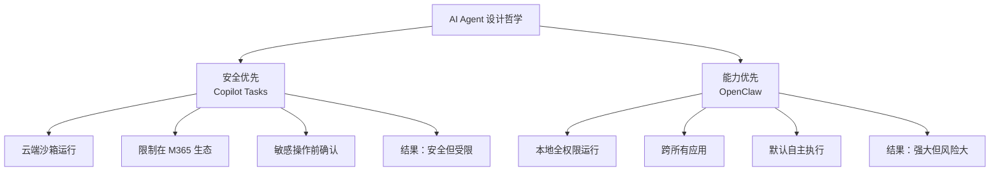

---
tags:
  - 竞品对比
  - OpenClaw
  - Microsoft
  - Copilot
aliases:
  - Copilot Tasks
  - OpenClaw 对比 Copilot Tasks
  - 微软 Copilot Tasks
---

# OpenClaw vs Copilot Tasks

**一句话总结**：Copilot Tasks 是微软对 OpenClaw 的回应，但走了一条截然相反的路——用"围墙花园"式的安全换取了能力的极大受限，堪称 AI Agent 设计哲学的两极。

## Copilot Tasks 概览

微软推出 **Copilot Tasks**——官方描述为"一个会自动执行的待办列表"，于 2026 年初进入研究预览阶段。

| 维度 | Copilot Tasks | [[OpenClaw 是什么|OpenClaw]] |
|------|--------------|----------|
| **部署** | 云端沙箱 | 本地自托管 |
| **能力范围** | Microsoft 365 生态内 | 跨所有应用和系统 |
| **安全模型** | 沙箱 + 确认机制 | Docker 可选，密钥明文 |
| **用户确认** | 敏感操作前必须确认 | 可配置，但默认自主执行 |
| **开放性** | 封闭生态 | MIT 开源，多模型支持 |
| **成熟度** | 研究预览阶段 | 已有大规模社区使用 |
| **定价** | 包含在 Microsoft 365 订阅中 | 免费 + API 费用 |

## 设计哲学的根本分歧

这两种设计代表了 AI Agent 领域最根本的哲学分歧：

### 微软的选择："围墙花园"

- **只在 Microsoft 365 生态内操作**：Word、Excel、Outlook、Teams、OneDrive
- **云端沙箱隔离**：Agent 无法访问用户的本地文件系统或操作系统
- **人在环中（Human-in-the-Loop）**：任何敏感操作（删除文件、发送邮件等）前必须获得用户确认
- **好处**：不可能出现 [[案例-Summer Yue 邮件删除灾难]] 这样的事故
- **代价**：无法完成"通过 Telegram 聊天开发 iOS 应用"这样的跨界任务

### OpenClaw 的选择："开放世界"

- **跨所有应用和操作系统**：邮件、日历、浏览器、终端、智能家居、金融应用
- **本地运行，全权限**：Agent 拥有与用户相同的系统权限
- **默认自主执行**：除非用户主动配置确认机制
- **好处**：能力几乎无限——能做到 14 个 Agent 协作这样的复杂编排
- **代价**：安全风险巨大——[[Gary Marcus 对 OpenClaw 的批评|Gary Marcus]] 的批评直指这一点

## 微软的战略动机

微软推出 Copilot Tasks 不仅是技术选择，更是商业策略：

1. **保护 M365 生态**：将 AI Agent 能力锁定在自家生态内，增加用户粘性
2. **回应市场压力**：OpenClaw 的爆发式增长（npm 周下载 127 万）迫使微软加速推出竞品
3. **风险管控**：作为上市公司，微软无法承受"AI Agent 删除用户数据"的 PR 灾难
4. **渐进式策略**：先以"研究预览"试水，观察用户反馈后再决定开放程度

## 核心洞察

1. **"安全 vs 能力"是 AI Agent 时代的基本矛盾**——Copilot Tasks 和 OpenClaw 分别代表了这个矛盾的两个极端
2. **微软的围墙花园策略可能是对的**——对于 90% 的企业用户来说，"在 M365 内安全地自动化"已经足够，不需要 OpenClaw 级别的自由度
3. **但 OpenClaw 社区不会因此萎缩**——技术爱好者和高级用户追求的恰恰是那"围墙之外"的 10% 能力
4. **最终的赢家可能是"可调节自主性"**——既不是完全开放也不是完全封闭，而是让用户根据场景自行选择信任级别
5. **Copilot Tasks 的"研究预览"标签本身就说明微软还没想清楚**——Agent 安全边界的最优解可能尚不存在

## 失败案例的对照

[[案例-Summer Yue 邮件删除灾难]] 恰好证明了两种模式的利弊：
- 在 Copilot Tasks 中，删除邮件前会请求确认 → **不会发生**
- 在 OpenClaw 中，上下文压缩丢失指令后 Agent 自主删除 200+ 封邮件 → **确实发生了**

但反过来，Copilot Tasks **无法**完成 Felix 的 $14,718 创业实验——那需要跨网站、社交媒体、支付系统的全面访问。

## 外部链接

- [GitHub Copilot](https://github.com/features/copilot)

## 相关笔记

- [[竞品对比总览]]
- [[案例-Summer Yue 邮件删除灾难]]
- [[安全边界与风险（总览）]]
- [[GitHub Copilot 2026年Q2更新]] — Copilot 转向 AI Credits 计费、Copilot App 技术预览

> 来源：[MakeUseOf](https://www.makeuseof.com/microsoft-answer-to-openclaw-looks-pretty-great/)
