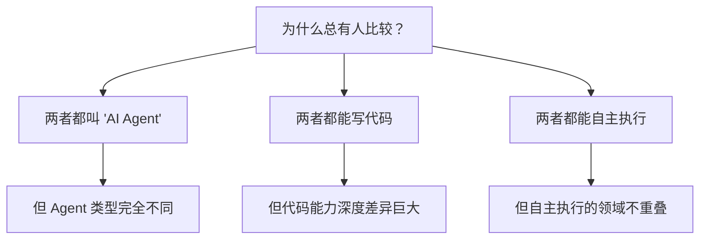

---
tags:
  - 竞品对比
  - OpenClaw
  - Devin
aliases:
  - OpenClaw 对比 Devin
---

# OpenClaw vs Devin

**一句话总结**：这不是一场对比，而是一个分类错误——Devin 和 OpenClaw 解决的是完全不同维度的问题，就像比较"私人秘书"和"外包程序员"。

## 全维度对比

| 维度 | [[OpenClaw 是什么|OpenClaw]] | [[Devin 分析|Devin]] |
|------|----------|-------|
| **类别** | 通用个人 AI 代理 | 自主软件工程代理 |
| **本质比喻** | 24/7 私人助理 | 远程 AI 程序员 |
| **核心能力** | 邮件、日历、消息、跨应用自动化 | 写代码、修 Bug、创建 PR、部署 |
| **部署** | 本地自托管 | 云端（Cognition 服务器） |
| **费用** | 免费 + API $5-30/月 | **$20/月起**（Pro）+ ACU 按量计费 |
| **运行模式** | 24/7 持续运行 | 任务制（接收 Issue → 交付 PR） |
| **界面** | WhatsApp / Telegram / Discord | Web 面板 + GitHub 集成 |
| **模型** | 多模型自由切换 | 自研模型 |
| **目标用户** | 技术爱好者 / 极客 | 工程团队 |
| **代码深度** | 可写代码但缺乏深度理解 | 端到端软件工程 |
| **非编码能力** | 邮件、日历、智能家居、购物等 | 几乎没有 |

## 为什么这个对比经常出现？

尽管两者定位完全不同，但"OpenClaw vs Devin"是社区中最常见的对比之一，原因在于：

1. **名称混淆**：两者都被标记为"AI Agent"，但一个是"通用型"，一个是"专业型"
2. **能力重叠的错觉**：OpenClaw 也能写代码（见 [[案例-Telegram 聊天开发 iOS 应用]]），但缺乏 Devin 级别的深度理解
3. **预算对比的误导**：$5-30/月 vs $20+/月（表面价格已趋同，但 ACU 按量计费可推高至 $300-500/月），忽略了能力维度的根本差异

## 成本-能力矩阵

| 场景 | OpenClaw 能做到？ | Devin 能做到？ | 最佳选择 |
|------|-----------------|---------------|----------|
| 管理邮件和日历 | 是 | 否 | OpenClaw |
| 跨应用自动化工作流 | 是 | 否 | OpenClaw |
| 修复 GitHub Issue | 勉强 | 专业级 | Devin |
| 大型代码库重构 | 否 | 是 | Devin |
| 通过聊天部署应用 | 是（基础） | 是（专业） | 看需求 |
| 自动超市购物 | 是 | 否 | OpenClaw |
| 创建 PR 并通过 CI | 否 | 是 | Devin |

## rentamac.io "Brain vs Body" 框架下的定位

根据 [[竞品对比总览]] 中 rentamac.io 的分析框架：

> "Claude is the Brain, OpenClaw is the Body."

在这个框架下：
- **Devin** = 专精于软件工程的"Brain + Hands"组合——既能思考架构，也能执行编码
- **OpenClaw** = 通用的"Body"——执行各种日常任务，但大脑（推理能力）依赖外部 LLM

## 核心洞察

1. **不要在"苹果和橙子"之间做选择**——如果你需要 AI 编码能力，比较 Devin vs Claude Code 更有意义；如果你需要日常自动化，OpenClaw 没有直接竞品
2. **Devin 表面降价至 $20/月但实际成本仍然不低**——ACU 按量计费意味着重度使用者实际月费可能回到 $300-500 区间。Devin 面向的工程团队一个高级工程师月薪 $15,000+，仍然划算
3. **两者的真正共同点是"Agent 自主性"的探索**——如何让 AI 在有限的人类监督下完成复杂任务链，这是两个项目共同面对的核心挑战
4. **未来可能出现融合**——想象一个既能帮你管理邮件、又能帮你修 Bug 的"全能 Agent"

## 外部链接

- [Devin 官网](https://devin.ai)

## 相关笔记

- [[Devin 分析]]
- [[竞品对比总览]]
- [[Windsurf 更名 Devin Desktop]] — Cognition 品牌整合

> 来源：[LaunchMyOpenClaw](https://launchmyopenclaw.com/openclaw-vs-devin)
