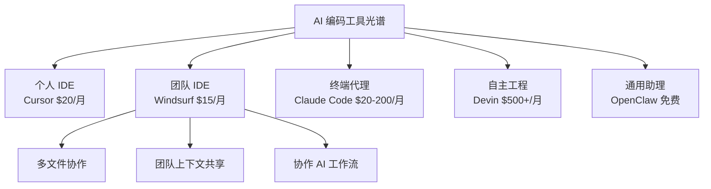

---
tags:
  - 竞品分析
  - Windsurf
  - IDE
  - 团队协作
aliases:
  - Windsurf
  - Windsurf IDE
---

# Windsurf 分析

**一句话总结**：Windsurf 是"团队版 Cursor"——当你的问题不是"我一个人怎么写更快"而是"我的团队怎么一起用 AI 写得更快"时，Windsurf 就是答案。

## 基本信息

| 维度 | 详情 |
|------|------|
| **类别** | 团队 AI IDE |
| **定位** | 多文件团队协作开发 |
| **核心能力** | 跨文件编辑、团队上下文共享、协作 AI |
| **许可** | 商业 |
| **定价** | **$15/月起**（行业内最低入门价之一） |
| **模型支持** | 多模型 |
| **运行模式** | 会话制 |

## 在行业格局中的定位



在 [[竞品对比总览|行业最佳实践]] 中的"六工具格局"：

```
写代码（终端）     → Claude Code
写代码（IDE）      → Cursor
团队协作开发       → Windsurf  ← 这里
快速原型           → Bolt
自主软件工程       → Devin
24/7 个人生活助理  → OpenClaw
```

## 与同类工具的四维对比

| 维度 | Windsurf | Cursor | Claude Code | [[OpenClaw 是什么|OpenClaw]] |
|------|----------|--------|-------------|----------|
| **类别** | 团队 AI IDE | AI IDE | 终端编码代理 | 自主 AI 代理 |
| **许可** | 商业 | 商业 | 商业 | MIT 开源 |
| **核心** | 多文件团队协作 | 代码编辑/补全 | 代码生成/重构 | 系统自动化 |
| **目标用户** | **开发团队** | 个人开发者 | 开发者 | 极客/高级用户 |
| **定价** | **$15/月起** | $20/月起 | $20/月起 | 免费 + API |
| **运行** | 会话制 | 会话制 | 会话制 | 24/7 |

## Windsurf 的差异化优势

1. **团队上下文共享**：团队成员可以共享项目上下文和 AI 对话，减少重复解释
2. **多文件协作编辑**：AI 理解跨文件的关联，在团队协作中减少冲突
3. **性价比**：$15/月起的定价低于 Cursor（$20/月），对预算敏感的团队有吸引力
4. **统一工作流**：团队不需要各自配置不同的 AI 工具，降低管理成本

## 与 OpenClaw 的关系

Windsurf 和 OpenClaw 几乎没有功能重叠：

- **Windsurf** 解决的是"团队怎么一起用 AI 写代码"
- **OpenClaw** 解决的是"个人怎么用 AI 自动化日常生活"

实际上，许多团队的最佳实践是 **"Windsurf（或 Cursor）用于编码 + OpenClaw 用于非编码自动化"**——80/20 的主辅工具比例。

## 核心洞察

1. **"团队协作"是 AI IDE 市场的下一个战场**——个人 AI 编码助手已经饱和，但团队级 AI 协作工具仍有巨大空白
2. **$15/月的定价策略暗示了市场竞争的激烈程度**——低于 Cursor 和 Claude Code，说明 Windsurf 在用价格换市场份额
3. **在 [[AI 编码助手市场数据]] 的 $85 亿市场中，团队 IDE 细分赛道增长最快**——因为企业采购决策更看重团队生产力而非个人效率

## 市场背景

根据 AI 编码助手市场数据：
- 全球 AI 编码助手市场 2026 年规模约 **$85 亿**
- GitHub Copilot 占 ~42% 市场份额（2000 万+用户）
- Cursor 已突破 **$10 亿 ARR**
- Windsurf 的具体市场份额数据尚未公开，但其团队定位使其避开了与 Copilot/Cursor 的正面竞争

## 外部链接

- [Windsurf 官网](https://windsurf.com)

## 最新动态（2026年3月）

- **3月18日全新定价方案**：Windsurf 从信用额度制改为配额制，简化了之前复杂的按量计费模型
- 这一定价调整发生在 [[Vibe Coding 融资爆发]] 背景下——当 Cursor 融资 23 亿、Lovable 融资 3.3 亿时，Windsurf 需要用更清晰的定价策略来吸引和留住用户
- 配额制的核心变化：用户不再需要关心每次 AI 调用消耗多少信用，而是按月获得固定的使用配额

## 最新动态（2026年Q2）——品牌终结

> **2026.6.2，Windsurf 正式更名为 Devin Desktop。** 详见 [[Windsurf 更名 Devin Desktop]]。

- Cognition 通过 OTA 更新将 Windsurf 更名为 Devin Desktop
- Cascade Agent 被 Rust 重写的 **Devin Local** 取代（30% token 效率提升）
- 默认界面从代码编辑器切换为 **Agent Command Center**——以 Agent 为中心而非以代码为中心
- 旧版 Cascade 支持截止日期：2026.7.1
- "Windsurf"作为独立品牌已不复存在，本笔记保留作为历史记录

## 相关笔记

- [[竞品对比总览]]
- [[AI 编码助手市场数据]]
- [[竞品成本对比]]
- [[Vibe Coding 融资爆发]] — 行业融资背景
- [[Windsurf 更名 Devin Desktop]] — 品牌整合完整记录

> 来源：[Skywork - 4-Tool Comparison](https://skywork.ai/blog/ai-agent/openclaw-vs-cursor-claude-code-windsurf-comparison/)
