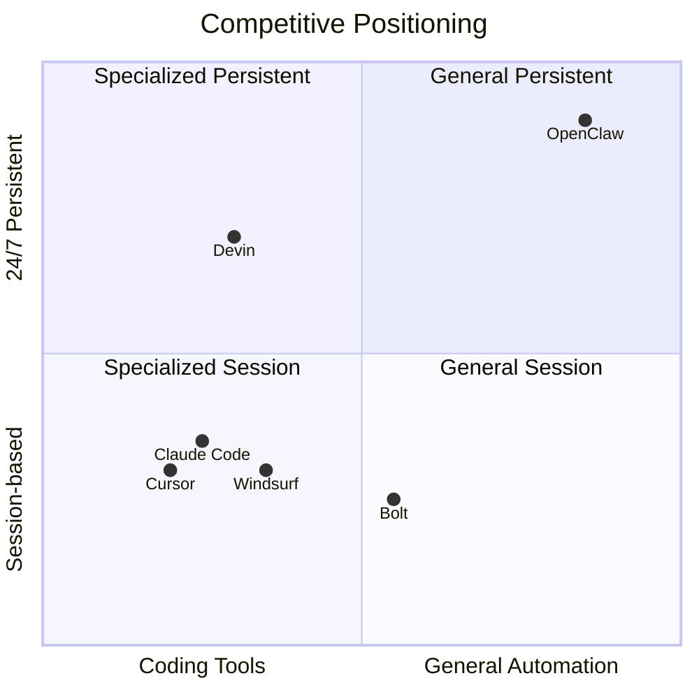

---
tags:
  - 竞品分析
  - 总览
  - OpenClaw
aliases:
  - 竞品分析总览
  - 对比概览
---

# 竞品对比总览

> "Comparing OpenClaw to Claude Code is like comparing a Swiss Army knife to a surgical scalpel."

[[OpenClaw 是什么|OpenClaw]] **不是**一个专业编码工具，而是一个**通用型 AI 生活自动化平台**。它属于 AI Agent 中"通用自主代理"的类别，其核心理念与 Agentic Coding 一脉相承——让大语言模型驱动的 Agent 自主完成任务。

## 核心对比矩阵



> 象限说明：X 轴从"专业编码工具"到"通用自动化平台"，Y 轴从"会话制运行"到"24/7 持续运行"

| 维度 | OpenClaw | [[Claude Code 分析|Claude Code]] | [[Cursor 分析|Cursor]] | [[Windsurf 分析|Windsurf]] |
|------|----------|-------------|--------|----------|
| **类别** | 自主 AI 代理 | 终端编码代理 | AI IDE | 团队 AI IDE |
| **许可** | MIT 开源 | 商业 | 商业 | 商业 |
| **核心** | 系统自动化 | 代码生成/重构 | 代码编辑/补全 | 多文件团队协作 |
| **目标用户** | 极客/高级用户 | 开发者 | 个人开发者 | 开发团队 |
| **定价** | 免费 + API | $20/月起 | $20/月起 | $15/月起 |
| **模型** | 多模型 | Claude only | 多模型 | 多模型 |
| **运行** | 24/7 | 会话制 | 会话制 | 会话制 |

## 行业最佳实践

根据 [[AI 编码助手市场数据]]，当前市场已形成明确分工（2026年Q2更新：Windsurf 已更名为 [[Windsurf 更名 Devin Desktop|Devin Desktop]]）：

```
写代码（终端）     → Claude Code（Opus 4.8 + Dynamic Workflows）
写代码（IDE）      → Cursor（3.7 Design Mode）
Agent 指挥中心     → Devin Desktop（原 Windsurf）
快速原型           → Bolt / Replit
自主软件工程       → Devin
Spec-driven 开发   → AWS Kiro IDE（新入局，详见 [[2026年Q2竞品新入局]]）
24/7 个人生活助理  → OpenClaw  ← 唯一占据此赛道
```

竞品对比的核心维度是[[个人 AI Agent vs 企业 AI Agent]]的路线分野——OpenClaw 走个人自主路线，Claude Code/Devin 走企业工程路线，两条路径在商业模式和技术架构上都有根本差异。其中 [[GitHub Copilot 分析|GitHub Copilot]] 作为市场先驱仍占据最大份额，但在 Agentic Coding 浪潮下正面临 Cursor 和 Claude Code 的夹击。Devin 代表了完全自主开发的极端方向，而 Windsurf 则聚焦团队协作场景。Replit Agent 走的是云端一体化路线，面向快速原型和部署。

> 多工具策略："Cursor for interactive daily coding, Claude Code for autonomous tasks, OpenClaw for custom automation." 80/20 的主辅工具比例。

## "Brain vs Body" 论

> "Claude is the Brain, OpenClaw is the Body."

- **Brain（大脑）= Claude**：Opus 4.8 SWE-Bench Pro 69.2%，1M token 上下文窗口，Dynamic Workflows 千级子 Agent 编排（详见 [[Claude Opus 4.7-4.8 发布]]）
- **Body（身体）= OpenClaw**：消息集成（WhatsApp/Telegram/12+ 平台）+ 24/7 持久运行 + 多模型路由。作为自主 AI Agent，OpenClaw 赋予大脑"身体"
- **最佳实践**：两者联用——OpenClaw 的守护进程架构 + Claude 的推理能力 = 目前可用的最强个人 AI 代理组合

## 详细对比

- [[OpenClaw vs Claude Code]]
- [[OpenClaw vs Cursor]]
- [[OpenClaw vs Devin]]
- [[OpenClaw vs Claude Cowork]]
- [[OpenClaw vs Copilot Tasks]]
- [[OpenClaw vs Claude Code Remote Control]]
- [[OpenClaw vs Google Project Mariner]]
- [[OpenClaw vs Replit Agent]]

## 外部链接

- [Claude Code](https://docs.anthropic.com/en/docs/claude-code)
- [Cursor](https://cursor.com)
- [GitHub Copilot](https://github.com/features/copilot)
- [Devin](https://devin.ai)
- [Windsurf](https://windsurf.com)
- [Google Project Mariner](https://deepmind.google/technologies/project-mariner/)
- [Replit](https://replit.com)

## 2026年3月更新索引

- [[Claude Code 2026年3月更新]] — Agent Teams、Agent SDK、Opus 4.6
- [[Cursor 2026年3月更新]] — MCP Apps、JetBrains、Composer 2
- [[GitHub Copilot 2026年3月更新]] — GPT-5.4、Jira Agent、Memory
- [[Devin 2026年3月更新]] — Nubank 案例、Devin Review
- [[Cursor Composer 2 与 Kimi 争议]] — 模型溯源争议
- [[Vibe Coding 融资爆发]] — 行业融资数据
- [[MCP 协议 2026年3月进展]] — MCP 协议生态扩展

## 2026年Q2更新索引

- [[Claude Code 2026年Q2更新]] — Dynamic Workflows、ultracode、Auto Mode
- [[Claude Opus 4.7-4.8 发布]] — Opus 4.7/4.8 连续迭代，SWE-Bench Pro 69.2%
- [[Anthropic Mythos 模型]] — Mythos 超级模型，限量发布
- [[Cursor 2026年Q2更新]] — 3.6 Auto-review、3.7 Design Mode
- [[GitHub Copilot 2026年Q2更新]] — AI Credits、Copilot App、usage-based billing
- [[GPT-5.5 发布]] — OpenAI 最强模型，1M 上下文
- [[Windsurf 更名 Devin Desktop]] — Cognition 品牌整合，Agent Command Center
- [[2026年Q2竞品新入局]] — AWS Kiro IDE、Gemini CLI→Antigravity、OpenCode

## 相关主题

- [[竞品成本对比]]
- [[Amazon Q Developer]] — AWS 的企业级 AI 编码助手（已宣布日落，被 [[2026年Q2竞品新入局|Kiro IDE]] 取代）
