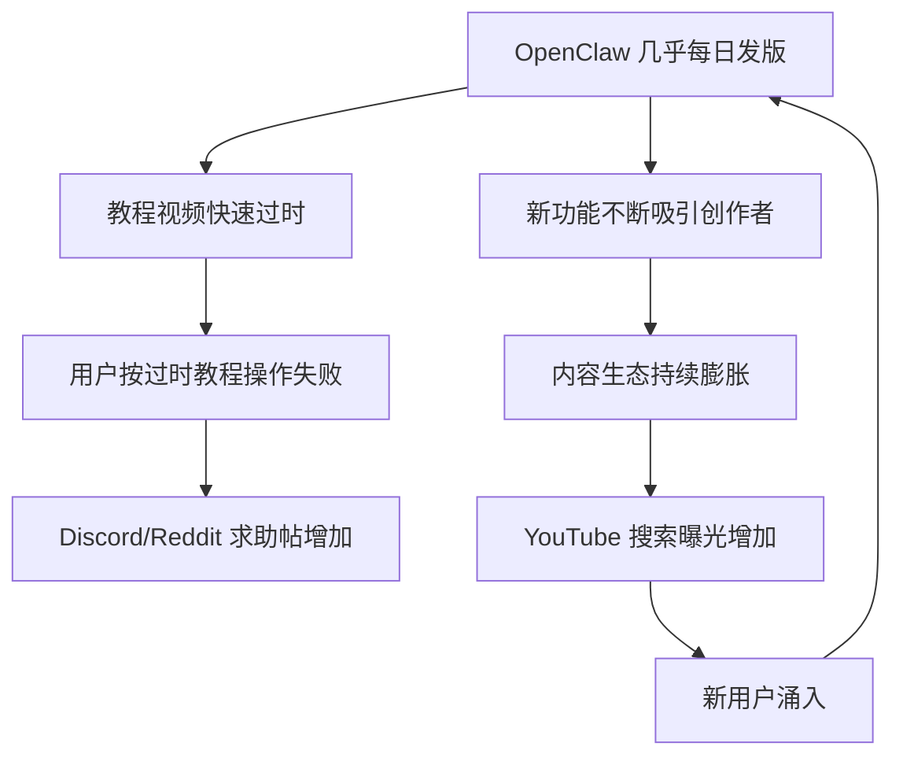

---
tags:
  - OpenClaw
  - YouTube
  - 教程
  - 内容生态
aliases:
  - OpenClaw YouTube
  - OpenClaw 视频教程
---

# OpenClaw YouTube 生态

YouTube 上已形成围绕 OpenClaw 的庞大内容生态。

**一句话总结**：YouTube 已成为 OpenClaw 最大的非官方学习平台，但"几乎每日发版"的迭代速度让大多数教程的保质期不超过两周——这既是社区热情的证明，也是内容生态的困境。

## 现状概览

| 指标 | 数据 |
|------|------|
| 教程视频数量 | 数千个（且持续增长） |
| 平均"保质期" | 约 1-2 周（因高频发版） |
| 主要语言 | 英语为主，中文内容快速增长 |
| 内容类型 | 入门教程、深度评测、实战工作流、Skill 开发 |

## 值得关注的创作者与内容

### VelvetShark — "OpenClaw after 50 days"

- 配套 **20 个真实工作流 prompt**，实用性最高
- 从日常使用者视角出发，展示了邮件管理、日程协调、内容策展等真实场景
- 不同于大多数"安装教程"，专注于实战工作流设计

### freeCodeCamp — 官方完整教程

- 面向入门开发者的系统化教程
- 覆盖从安装到部署的完整流程，包括 Docker 部署和 [[MCP 协议|MCP 配置]]
- 作为全球最大的免费编程教育平台，其参与标志着 OpenClaw 进入主流开发者视野，推动了可及性突破

### YouTube Vision Skill v5.5

- 让 Agent 观看和分析 YouTube 视频
- 实现视频内容理解与自动化摘要
- 属于 [[Skills 市场]] 的创新应用——Agent 从"文本处理"扩展到"多模态理解"

### 其他活跃创作者

- 各类"X days with OpenClaw"系列视频形成了特殊的内容品类
- 中文区 B 站也出现了大量配置教程和实战演示

## 内容生态的双刃剑

### 过时问题的具体表现

1. **API 变更**：Skill 安装命令、配置格式频繁变化
2. **安全更新**：安全配置建议不断更新
3. **功能重命名**：项目从 Clawdbot → Moltbot → OpenClaw 的更名历史本身就让大量视频标题失效

## 与整体传播的关系

YouTube 内容生态是 OpenClaw 传播链条中的关键放大器：

1. **GitHub Stars**（[[OpenClaw GitHub 数据分析|375K+ Stars]]）和 **npm 下载量**（[[OpenClaw npm 下载数据|周下载 ~77 万]]）吸引技术人群
2. YouTube 教程将技术产品**翻译为普通人可理解的形式**，这也是 Vibe Coding 理念的一种体现
3. 观众中的非技术用户被吸引后，推动了编程民主化的叙事

## 核心洞察

1. **视频内容的"半衰期"是衡量开源项目迭代速度的隐性指标**——OpenClaw 的教程保质期仅 1-2 周，这在开源项目中极为罕见
2. **VelvetShark 的"工作流 prompt"模式值得关注**——相比教"怎么安装"，教"怎么用好"的内容更抗过时
3. **Vision Skill 代表了 Agent 能力边界的扩展方向**——从文本到多模态，Agent 正在获得"眼睛"，这与大语言模型的多模态演进趋势一致
4. **YouTube 生态的繁荣本身就是社区真实需求的证据**——如果产品只是炒作，不会有这么多人持续制作教程内容（对比 [[OpenClaw Wrapper 创业潮]] 的商业生态）

## 相关笔记

- [[OpenClaw 社区活动与生态]]
- [[OpenClaw GitHub 数据分析]]
- [[OpenClaw npm 下载数据]]

## 外部链接

- [OpenClaw GitHub](https://github.com/anthropics/openclawx)
- [ClawHub](https://clawhub.dev)

> 来源：YouTube 社区观察、[VelvetShark](https://youtube.com/@velvetshark)、[freeCodeCamp](https://youtube.com/@freecodecamp)
