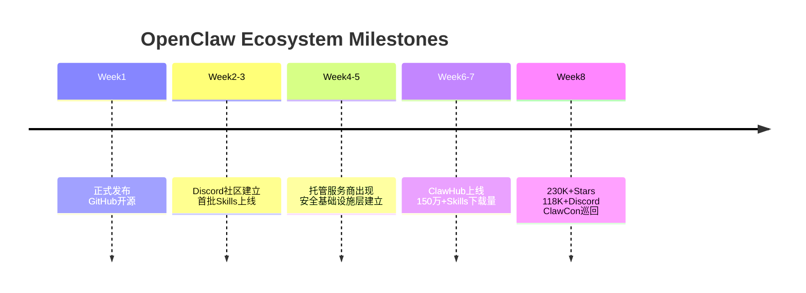

---
tags:
  - 生态系统
  - 增长
  - OpenClaw
aliases:
  - 生态速度
  - 增长数据
---

# OpenClaw 生态系统形成速度

OpenClaw 发布仅 **2 个月** 后就形成了完整的生态系统，速度令人瞩目。

## 2个月生态形成时间线

## 关键数据

- **375K+** GitHub Stars（[[OpenClaw GitHub 数据更新 2026Q2|2026Q2 最新数据]]，从 334K 持续增长）
- **176,000+** Discord 成员（Q2，从 118K 增长 49%）
- 全球会议巡回（ClawCon）——Q2 已扩展至密歇根、新加坡、多伦多三城（[[ClawCon 2026 Q2]]）
- **3,900 万+** Skills 总下载量
- [[OpenClaw npm 下载数据|npm 周下载量]] ~77 万
- **320 万** 月活用户（MAU）
- **3,800 万** 网站月访问量

## 已形成的生态类别

| 类别 | 说明 |
|------|------|
| 托管服务 | managed hosting 平台 |
| LLM 基础设施 | 模型路由服务 |
| 安全基础设施 | 保护层 |
| 市场服务 | 技能市场 |
| 社交网络 | Agent 构建者社区 |
| 验证工具 | TrustMRR 创业验证平台 |

> "Some newly-created startups within this ecosystem are already generating revenue."

这种速度得益于 MIT License 的开放性和 [[Peter Steinberger]] 早期建立的开源文化。OpenClaw 生态的形成速度堪比早期 [[npm 生态系统]]，但也继承了同样的安全债务——快速增长总是以牺牲审查为代价。[[OpenClaw 病毒级文化事件|病毒级文化事件]] 也极大加速了生态扩张。

## 对比参考

这种生态形成速度可与竞品进行对比分析。

## 相关笔记

- [[OpenClaw GitHub 数据分析]]
- [[OpenClaw 核心生态项目]]

## 外部链接

- [OpenClaw GitHub](https://github.com/anthropics/openclawx)
- [ClawHub](https://clawhub.dev)
- [npm](https://npmjs.com)
- [Hacker News](https://news.ycombinator.com)

> 来源：[HN Discussion - Ecosystem](https://news.ycombinator.com/item?id=47175503)
