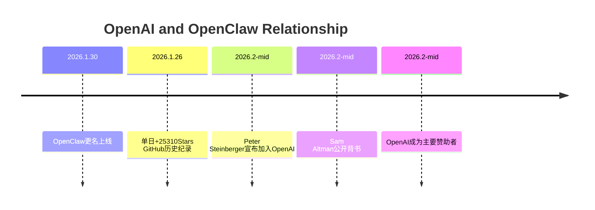

---
tags:
  - 赞助
  - 商业
  - OpenClaw
aliases:
  - 赞助者
  - Sponsors
---

# OpenClaw 赞助商

**一句话总结**：一个开源项目的赞助商名单就是它的"行业信用评级"——当 OpenAI 出现在赞助名单上时，说明即使是最大的商业 AI 公司也认为 OpenClaw 的生态值得投资。

## 赞助商详情

| 赞助商 | 类型 | 背景 | 赞助意义 |
|--------|------|------|----------|
| **OpenAI** | AI 模型厂商 | 全球最大 AI 公司之一，ChatGPT 开发者 | 创始人 [[Peter Steinberger]] 加入 OpenAI 后的主要赞助 |
| **Blacksmith** | CI/CD 基础设施 | GitHub Actions 加速服务 | 支持 OpenClaw 的构建与部署基础设施 |
| **Convex** | 后端即服务 | 实时数据库与云函数平台 | 可能为 Skills 市场或社区应用提供基础设施 |

## OpenAI 赞助的深层含义

OpenAI 成为 OpenClaw 主要赞助者这件事本身就值得深入分析：

### 时间线

### Sam Altman 的公开背书

> "Peter Steinberger is joining OpenAI to drive the next generation of personal agents. He is a genius with a lot of amazing ideas about the future of very smart agents interacting with each other to do very useful things for people."

这条推文获得了 **450 万浏览、3.9K 回复、5.4K 转发、37K 点赞**。

### Mark Zuckerberg 也曾争夺

据 Fortune 报道，Meta CEO Mark Zuckerberg 也亲自向 Steinberger 伸出橄榄枝。OpenAI 和 Meta 同时争夺一个开源项目的创始人，这在 AI 行业史上极为罕见。

## 赞助模式分析

OpenClaw 的赞助结构揭示了开源 AI 项目的一种新型商业生态：

1. **模型厂商赞助 Agent 框架**：OpenAI 赞助 OpenClaw 的逻辑与 Google 赞助 Firefox 类似——Agent 框架是模型的"分发渠道"，OpenClaw 用户调用 API 就是 OpenAI 的收入
2. **基础设施赞助**：Blacksmith 和 Convex 通过赞助获得在快速增长社区中的曝光和整合
3. **与 [[OpenClaw Foundation 治理|社区捐款]] 的关系**：社区 5 天内自发捐款 $35,000，加上企业赞助，项目的资金来源多元化

## 与竞品赞助格局的对比

| 项目 | 主要支持者 | 商业模式 |
|------|-----------|----------|
| **OpenClaw** | OpenAI + 社区赞助 | 完全开源（MIT License），靠赞助和社区捐款 |
| **Cursor** | 风投支持 | 商业产品，$10 亿+ ARR |
| **Claude Code** | Anthropic 自研 | 商业产品，$25 亿年化收入 |
| **Devin** | Cognition Labs 风投 | 商业产品，$500+/月 |

OpenClaw 是唯一采用"开源 + 赞助"模式的主要 AI Agent 项目。

## 核心洞察

1. **赞助商名单是 OpenClaw 最有说服力的"行业认可"标志**——胜过任何 GitHub Stars 数字
2. **OpenAI 的赞助揭示了一个战略逻辑**：Agent 框架是 LLM 的"最后一公里"——控制了 Agent 就控制了 API 调用量，详见 [[OpenAI 为什么收编 OpenClaw]]
3. **创始人加入 OpenAI 是把双刃剑**——一方面带来了顶级赞助和行业背书，另一方面社区担忧项目会逐渐"被收编"，参见 [[OpenClaw 项目治理变迁]]
4. **赞助商结构的多元化程度反映了项目的健康度**——目前仅 3 家赞助商，相比成熟的开源项目（如 Linux Foundation）还有很大差距
5. **社区 5 天捐款 $35,000 说明底层需求是真实的**——不是靠赞助商"输血"维持，而是有真实的社区经济基础

## 2026 年 3 月更新：赞助商大幅扩展

截至 2026 年 3 月，活跃赞助商已从 3 家扩展至 **185 家**，新增的重要赞助商包括 Tencent、TencentCloud、Volcengine（火山引擎）、Vercel 等。中国科技企业的加入标志着 OpenClaw 在亚洲市场获得了企业级信任。详见 [[OpenClaw GitHub 数据更新 2026Q1]]。

## Q2 赞助商更新

- **GitHub** 于 2026 年 4 月初成为官方赞助商，并提供 Copilot Pro+、安全资金等支持
- **百度** 成为首个赞助 OpenClaw 的中国大型科技公司（2026 年 3 月 14 日）
- **NVIDIA NemoClaw** 企业安全栈的发布合作伙伴包括 Box、Cisco、Atlassian、Salesforce、SAP、CrowdStrike
- 完整 Q2 生态数据见 [[OpenClaw GitHub 数据更新 2026Q2]]

## 相关笔记

- [[OpenClaw 项目治理变迁]]
- [[商业化路径]]
- [[竞品对比总览]]
- [[Peter Steinberger]]

## 外部链接

- [OpenClaw GitHub](https://github.com/anthropics/openclawx)
- [ClawHub](https://clawhub.dev)
- [npm](https://npmjs.com)

> 来源：[Fortune - Peter Steinberger](https://fortune.com/2026/02/19/openclaw-who-is-peter-steinberger-openai-sam-altman-anthropic-moltbook/) | [Sam Altman on X](https://x.com/sama/status/2023150230905159801)
