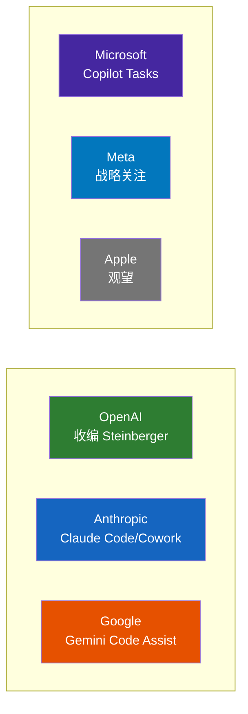

---
tags:
  - 竞争
  - 大厂
  - Agent
aliases:
  - Agent竞赛
  - 大厂Agent布局
---

# 大厂 Agent 竞赛

![[assets/big-tech-race.jpg]]

## 各大厂 Agent 布局对比

## 各公司布局

| 公司 | Agent 产品 | 状态（3月） | Q2 更新 |
|------|-----------|------|------|
| **OpenAI** | 收编 [[Peter Steinberger]]，Agent 战略核心化 | 进行中 | GPT-5.5（4.23 发布），强化 Agentic 任务 |
| **Anthropic** | Claude Code + Claude Cowork | 已发布 | Claude 写自身 80%+ 代码；Claude Opus 4.8 发布 |
| **Google** | Gemini Code Assist + Project Mariner | 迭代中 | **Cloud Next 2026 大动作**（见下方 Q2 更新） |
| **Microsoft** | Copilot Tasks | 研究预览 | **Agent 365 GA**：跨平台 Agent 控制面板 |
| **Meta** | 未公开具体 Agent 产品 | 战略关注 | 裁员优化，AI 支出继续加大 |
| **Apple** | 未知 | 观望 | — |

## NIST AI Agent 标准计划

美国国家标准与技术研究院启动了 **"AI Agent 标准计划"**，确保下一代 AI Agent 能够安全地代表用户行动。这与安全风险的讨论密切相关。

这意味着 Agent 已经进入了**国家级标准制定的视野**。

## Agentic AI Foundation (AAIF)

2025 年 12 月 9 日，**Linux Foundation** 成立 **Agentic AI Foundation (AAIF)**。

### 三个创始项目

| 项目 | 贡献方 | 定位 |
|------|--------|------|
| **[[MCP 协议|MCP]]**（Model Context Protocol） | Anthropic | AI 模型连接工具/数据的通用标准协议 |
| **goose** | Block | 开源、本地优先的 AI Agent 框架 |
| **AGENTS.md** | OpenAI | AI 编码 Agent 的项目级指导标准 |

### 铂金成员（8 家）

AWS、Anthropic、Block、Bloomberg、Cloudflare、Google、Microsoft、OpenAI

2026 年 2 月 24 日更新：新增 97 名成员，总计达到 **146 家组织**。

> Jim Zemlin："Nearly 150 organizations joining the AAIF in its early days is a strong signal that **agentic AI is shifting from experimentation to real-world deployment**."

[[AAIF 基金会|AAIF]] 的成立意味着 Agentic AI 正在从实验阶段走向**企业基础设施**阶段。

**2026 年 5 月更新**：AAIF 再增 43 名成员（4 Gold / 27 Silver / 12 Associate），总计达到 **190 家组织**。新成员包括 Atlassian、Teradata、Fastly、Consumer Reports、美国陆军、Rust Foundation、多所大学和国家实验室。6 月 4 日接纳 **agentgateway**（开源 MCP/A2A/LLM 网关）为最新托管项目。

## Q2 大厂动态更新（2026年4-6月）

### Google Cloud Next 2026（4月）

Google 发布了 **Gemini Enterprise Agent Platform**——一个完整的 Agent 构建、治理和优化平台，包含 Agent Designer、Inbox、长时运行 Agent、Skills 等。同时发布 **Agentic Data Cloud**（AI 原生数据架构）和 **TPU 8t**（训练性能提升近 3 倍）。

最重要的是，Google 的 **Agent2Agent (A2A) 协议**已升至 v1.2，**150+ 组织在生产环境中使用**（非试点），支持签名 Agent Cards（域名加密验证）和多租户。Azure AI Foundry、Amazon Bedrock AgentCore 和 Google Cloud 均已原生集成 A2A。

### Microsoft Agent 365（5月 GA）

Agent 365 正式可用——一个跨 Microsoft、AWS 和 Google Cloud 的 Agent 控制面板，提供发现、治理和安全能力。这标志着 Microsoft 从"Copilot 功能"上升为"Agent 平台"。

### Anthropic "Code with Claude"（5月）

Anthropic 宣布 Claude 现在写自身 **80%+ 的代码**（后续报道称超过 90%）；工程师日均合并代码量是 2024 年的 8 倍；Claude 在最复杂开放式工程问题上成功率达 76%。

## 相关笔记

- [[MCP 协议]]
- [[竞品对比总览]]
- [[多 Agent 竞争格局]]
- [[2026 Agent 元年]]
- [[商业化路径]]
- [[AI Agent 市场趋势 2026 Q2]] — Q2 市场全景
- [[EU AI Act 2026 进展]] — 监管进展

## 外部链接

- [OpenAI](https://openai.com)
- [Anthropic](https://anthropic.com)
- [Gartner AI](https://www.gartner.com/en/topics/artificial-intelligence)
- [Google Cloud Next 2026 Wrap Up](https://cloud.google.com/blog/topics/google-cloud-next/google-cloud-next-2026-wrap-up)
