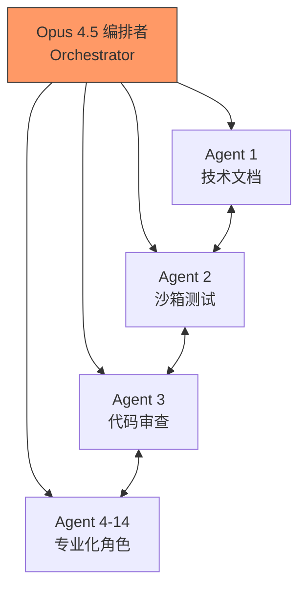
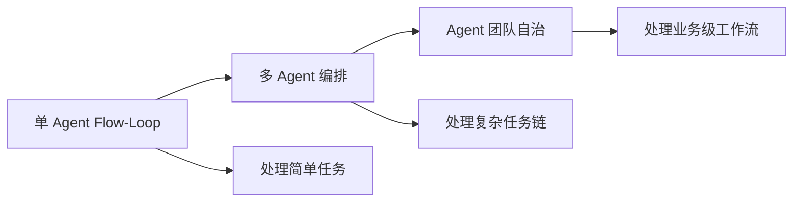

---
tags:
  - 案例
  - 多Agent
  - 编排
  - OpenClaw
aliases:
  - Kev's Dream Team
  - 14个Agent
  - 多Agent协作
---

# 案例：14 个 Agent 协作系统

**一句话总结**：当单个 Agent 不够用时，答案不是让它更聪明，而是让多个 Agent 分工合作——14 个 Agent + Opus 4.5 编排者 = 目前已知最大规模的个人多 Agent 部署。

## 案例概述

**人物**：@adam91holt
**案例**：搭建了一个 14+ Agent 的 多Agent协作架构 系统，每个 Agent 承担专业化角色

## 架构详解

### 核心组件

| 组件 | 职责 | 说明 |
|------|------|------|
| **Opus 4.5 编排者** | 任务分配与协调 | 整个系统的"大脑"，决定哪个 Agent 处理什么任务 |
| **技术文档 Agent** | 文档生成与维护 | 自动更新项目文档 |
| **沙箱框架 Agent** | 安全测试环境 | 在隔离环境中测试代码变更 |
| **通信层** | Agent 间自主通信 | 多 Agent 间不通过人类中介直接交流 |

### 关键技术要点

1. **编排模式（Orchestrator Pattern）**：Opus 4.5 作为唯一的编排者，接收任务后将其分解为子任务，分配给专业化 Agent
2. **自主通信**：Agent 之间可以直接交流，无需人类中介——Agent A 完成子任务后，自动将结果传递给 Agent B
3. **专业化分工**：每个 Agent 专精一个领域，而不是让一个 Agent 做所有事
4. **完整的技术文档和沙箱框架**：说明系统设计经过深思熟虑，不是简单的"多开几个 Agent"

## 与其他多 Agent 案例的规模对比

| 案例 | Agent 数量 | 编排者 | 应用领域 | 成本 |
|------|-----------|--------|----------|------|
| **本案例** | **14+** | Opus 4.5 | 技术开发 | 未公开 |
| [[案例-MFS Corp 零人类员工 AI 公司]] | 6 | Morgan（参谋长） | 全业务运营 | ~$50/月 |
| [[案例-Jesse Genet 家庭教育系统]] | 5 | 无统一编排 | 家庭管理 | 未公开 |
| [[案例-三个 AI 人格深度评测]] | 3 | 无统一编排 | 个人助理 | €5-7/月+API |

14+ Agent 的规模是已知案例中最大的，这是 [[多Agent协作架构]] 的最复杂实战案例，说明协作架构的复杂度上限还远未达到。

## 技术分析：为什么需要 14 个 Agent？

单个 Agent 的能力受限于：
1. **上下文窗口**：即使是 200K token 的窗口，对于大型项目也不够
2. **专业深度**：一个 Agent 很难同时精通代码审查、文档写作、安全测试
3. **并行效率**：多个 Agent 可以同时处理不同任务，而单 Agent 只能串行

这与人类团队的逻辑完全一致——你不会让一个人同时当产品经理、架构师和测试工程师。这也是 Agentic AI 范式下 Claude 模型系列 等大语言模型被用作编排核心的原因。

## 核心洞察

1. **编排者的选择至关重要**——Opus 4.5 被选为编排者说明任务分配需要最强的推理能力，这是系统的"瓶颈点"，也体现了模型无关架构的优势——可以为不同角色选择最合适的大语言模型
2. **Agent 间的自主通信是多 Agent 系统的分水岭**——如果所有通信都经过人类中介，那只是"多个独立 Agent"而非"协作系统"
3. **14 个 Agent 的规模揭示了一个趋势**——未来的 AI 系统不是一个超级 Agent，而是一个 Agent 团队
4. **从 [[Agent-Flow-Loop 原理]] 到多 Agent 编排是一个自然演进**——单 Agent 的 Flow-Loop 解决简单任务，多 Agent 编排解决复杂任务
5. **这个案例的开源化（GitHub）意味着任何人都可以复制和改进**——这与 OpenClaw 核心生态项目 的开源精神一致

## 与 Agent-Flow-Loop 的关系

这是 [[Agent-Flow-Loop 原理]] 的高级扩展：

从单 Agent 到 14 Agent 的演进路径：
- **阶段 1**：单个 Agent 处理所有任务（大多数用户）
- **阶段 2**：2-5 个专业化 Agent（如 Jesse Genet 的 5 Agent 系统）
- **阶段 3**：6+ Agent + 编排者（如 MFS Corp 的 6 Agent 架构）
- **阶段 4**：14+ Agent + 高级编排者（本案例）

## 相关笔记

- [[案例-MFS Corp 零人类员工 AI 公司]] — 6 Agent 商业化案例
- [[案例-Citi 银行 Arc 平台]] — 企业级多 Agent 平台

## 来源

- [GitHub - Orchestrated AI Articles](https://github.com/adam91holt/orchestrated-ai-articles)
- [OpenClaw Showcase](https://docs.openclaw.ai/start/showcase)
- [X 原帖 - @adam91holt](https://x.com/adam91holt)
