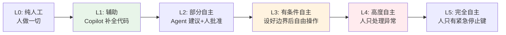

## AI Agent 是什么

用最简单的话说：**AI Agent 是一个能自己思考和行动的 AI 程序。**

普通的 AI（比如 ChatGPT 聊天）像是一个只会回答问题的学生——你问一句，它答一句。而 Agent 像是一个能自己做事的助手——你说"帮我订机票"，它会自己去查航班、比价格、填表单、完成预订。

核心区别在于三个能力：**感知**环境、**决策**下一步、**执行**动作。这三件事形成循环（即 [[Agent-Flow-Loop 原理|Agent Flow Loop]]），Agent 就一直转下去，直到任务完成。

## 分类体系

经典分类有五种，按"聪明程度"递增：

| 类型 | 一句话解释 | 类比 |
|------|-----------|------|
| **简单反射式** | 看到 X 就做 Y，没有记忆 | 恒温器 |
| **基于模型的反射式** | 能记住之前发生了什么 | 有经验的客服 |
| **目标驱动式** | 会为了目标做规划 | 导航软件 |
| **效用驱动式** | 不仅达到目标，还要找最优解 | 理财顾问 |
| **学习式** | 能从错误中学习，越用越聪明 | 实习生 → 老员工 |

2026 年还出现了**多 Agent 系统**——多个 Agent 协作，像一个团队各司其职（详见 [[多Agent协作架构]] 和 Agent 编排模式）。Claude Code 的 [[Dynamic Workflows]] 可在单次任务中编排最多 1,000 个子 Agent。

### 2026 年新分类体系

经典五分类之外，2026 年行业形成了更贴合市场的**四级阶梯**：

| 级别 | 类型 | 代表产品 | 核心区别 |
|------|------|----------|----------|
| L1 | 聊天机器人 | 基础 ChatGPT | 单轮问答 |
| L2 | 副驾驶（Copilot） | GitHub Copilot | 辅助补全，人主导 |
| L3 | Agent | Claude Code、OpenClaw | 自主规划+执行，人审批 |
| L4 | 数字员工 | 持久运行的 Agent 团队 | 长期角色，跨任务记忆 |

另一种**按行为分类**的维度将 Agent 分为四类：反应式（响应触发器）、规划式（分解目标）、协作式（多 Agent 团队）、持久式（长期运行的数字员工）。

## 自主性光谱

自主性不是"有或没有"，而是一个**光谱**，类似自动驾驶的分级：

大多数实际价值在 **L2-L4 之间**，而不是两端极值。

## OpenClaw 在光谱中的位置

[[OpenClaw 是什么|OpenClaw]] 大约处于 **L3-L4 之间**：它能自主执行复杂任务链（查航班、比价、下单），但通过 权限控制机制 和 Human-in-the-loop 机制让用户在关键节点保持控制。用户可以根据信任程度调节这个滑块——新手把它当 Copilot 用，老手让它全自主跑。这种灵活性也是 自主执行与人机协作 理念的核心体现。

## 关键洞察

> "我们不需要达到 L5 才能让 Agent 改变世界。每个级别都带来价值，不同场景需要不同的自主度。"

---

**相关笔记：** [[Agentic AI]] | OpenClaw 是什么 | Agent Execution Loop | 自主决策循环 | [[Tool Use 机制]] | [[记忆系统]] | [[AI Agent 市场规模]] | [[Dynamic Workflows]] | [[ACP 协议]]
