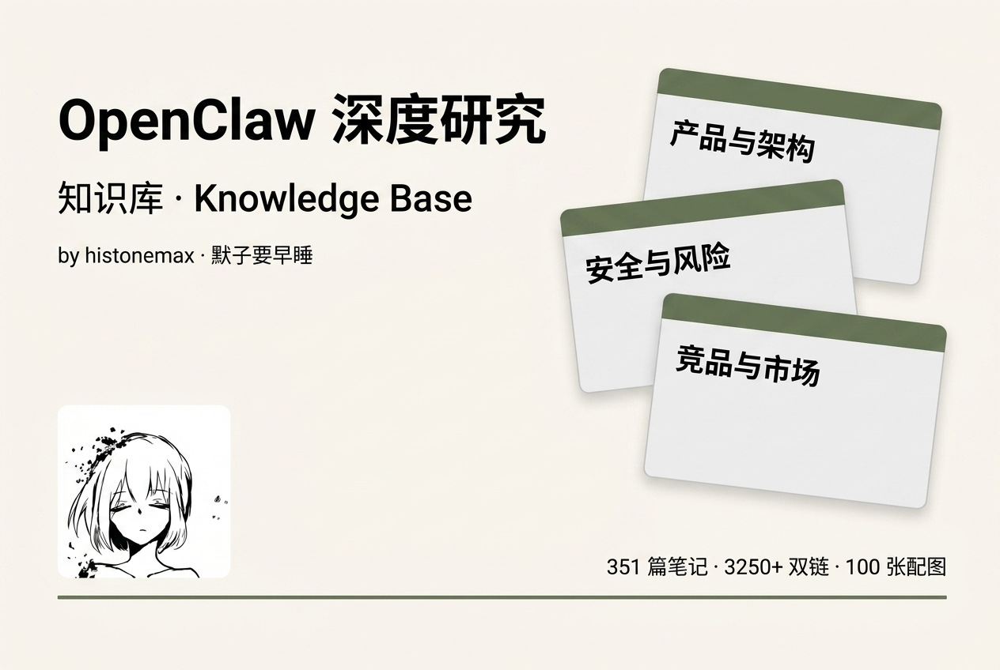
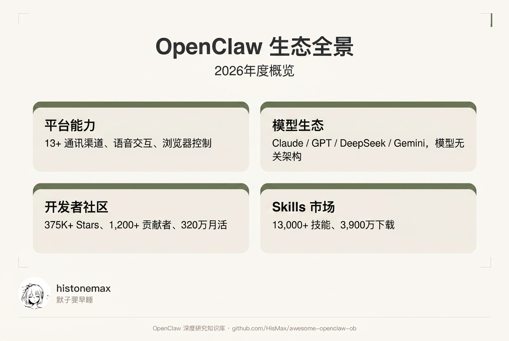
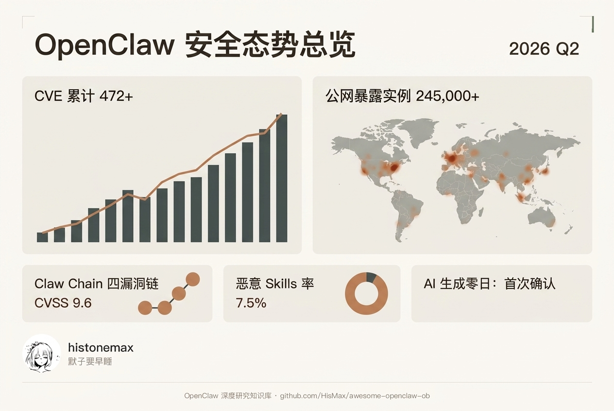
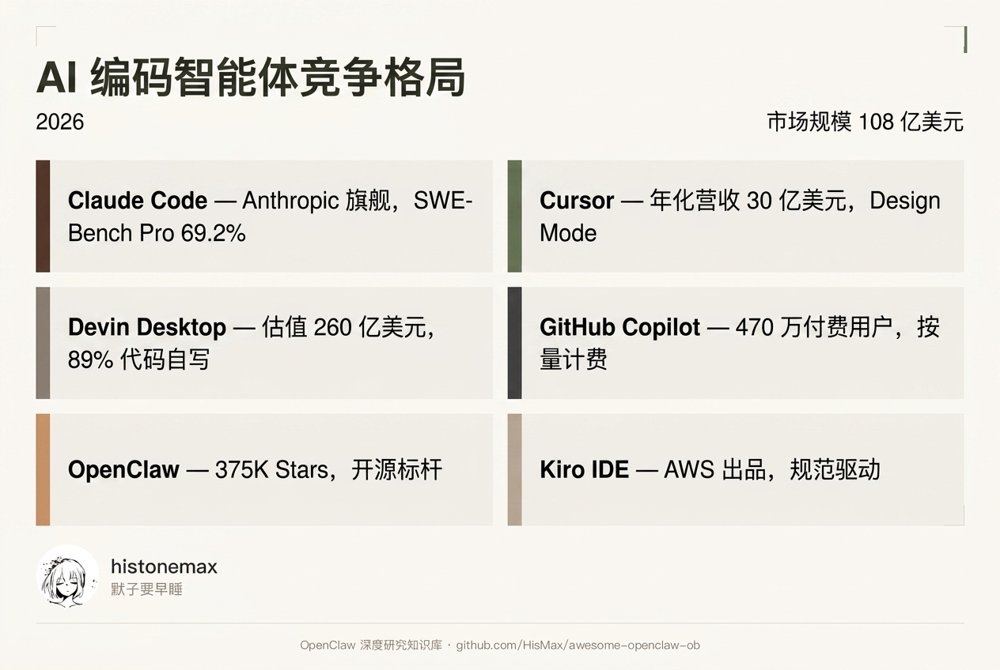
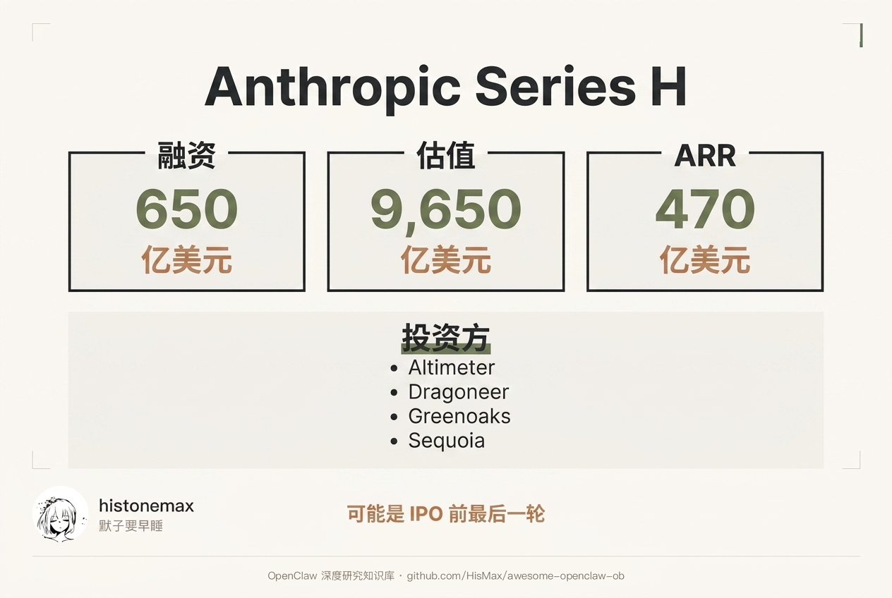
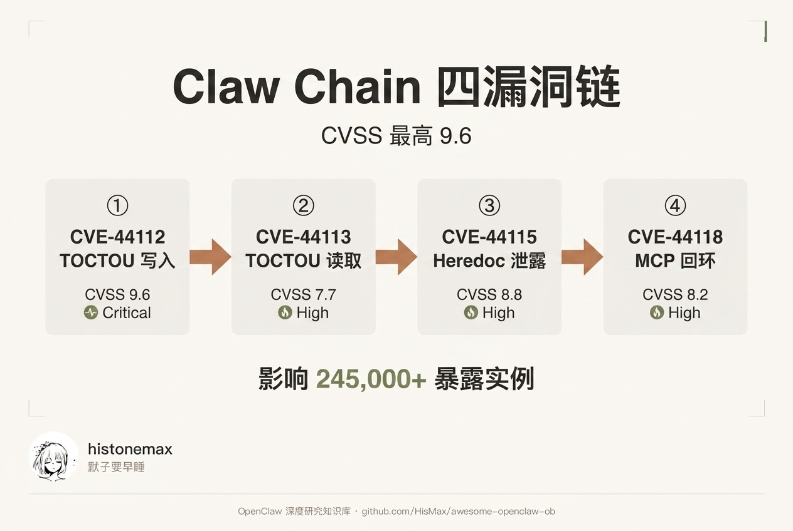

<p align="center">
  
</p>

<p align="center">
  <a href="https://obsidian.md"></a>
  <a href="https://creativecommons.org/licenses/by-sa/4.0/"></a>
  <a href="#%E7%9F%A5%E8%AF%86%E5%BA%93%E7%BB%93%E6%9E%84"></a>
  <a href="#%E7%9F%A5%E8%AF%86%E5%BA%93%E7%BB%93%E6%9E%84"></a>
  <a href="#%E9%85%8D%E5%9B%BE%E9%A2%84%E8%A7%88"></a>
</p>

<p align="center">
  <b>351 篇原子化笔记 · 3250+ 双向链接 · 100 张 SCI 风格配图 · 9 大主题全覆盖</b>
</p>

<p align="center">
  <a href="https://watcha.cn/@mozi">观猹 @mozi</a> · <a href="https://www.xiaohongshu.com/user/profile/5b883967b95f4f00016df1f7">小红书 @默子要早睡</a> · <a href="https://linux.do/">LinuxDO 社区</a>
</p>

---

> **OpenClaw** 是一个免费、开源的自主 AI Agent 框架，运行在用户本地设备上，通过 WhatsApp、Telegram、Discord 等即时通讯应用连接大语言模型来自主执行任务。GitHub 375K+ Stars，月活 320 万。

## 这是什么

OpenClaw 的火爆让信息量大到让人疲惫。与其在焦虑中盲目跟风，不如在看清全貌后再精准入局。**没有调研，就没有发言权。**

默子花了一周时间深度调研，制作成了这份 **Obsidian 原子化知识库**，覆盖产品架构、安全风险、竞品分析、生态社区、商业投资、趋势预测、使用案例、基础概念、关键人物 9 大维度，数据更新至 **2026 年 6 月**。

## 配图预览

每个核心节点都配有 SCI 报告风格的信息图，在 Obsidian 中打开即可查看：

<p align="center">
  
</p>

<p align="center">
  
  
</p>

<p align="center">
  
  
</p>

## 知识库结构

| 目录 | 篇数 | 主题 | 推荐入口 |
|:-----|:----:|:-----|:---------|
| `01-产品与架构` | 56 | 核心架构、执行循环、记忆系统、版本更新 | OpenClaw 是什么 → Agent Execution Loop |
| `02-安全与风险` | 46 | 漏洞分析、CVE、Claw Chain、安全态势 | 安全边界与风险（总览）→ Claw Chain 四漏洞链 |
| `03-竞品与市场` | 39 | Claude Code、Cursor、Devin、Copilot 对比 | 竞品对比总览 → Claude Code 分析 |
| `04-生态与社区` | 61 | MCP 协议、ClawHub、社区数据、ACP | MCP 协议 → OpenClaw 社区热度总览 |
| `05-商业与投资` | 29 | Anthropic 融资、市场规模、商业化 | Anthropic Series H → AI Agent 市场规模 |
| `06-趋势与未来` | 21 | Agent 元年、EU AI Act、技术成熟度 | 2026 Agent 元年 → AI Agent 技术成熟度 |
| `07-使用案例` | 18 | Citi Arc 平台、MFS Corp、真实案例 | 案例-Citi 银行 Arc 平台 |
| `08-基础概念` | 61 | Agentic AI、LLM、SWE-Bench、ACP | Agentic AI → Claude 模型系列 |
| `09-人物与事件` | 18 | Dario Amodei、Karpathy、龙虾文化 | Dario Amodei → v2026.3.22 发布事件 |

## 快速开始

```bash
# 1. 克隆仓库
git clone https://github.com/HisMax/awesome-openclaw-ob.git

# 2. 用 Obsidian 打开文件夹作为 Vault
# 3. 从「OpenClaw 知识库.md」开始探索
# 4. 打开 Graph View 查看全局知识图谱
```

## 2026 Q2 更新亮点

本次更新覆盖 2026 年 4-6 月全部重大事件：

| 事件 | 要点 |
|:-----|:-----|
| Anthropic Series H | 融资 $650 亿，估值 $9,650 亿，近万亿 |
| Claude Opus 4.8 | SWE-Bench Pro 69.2%，Dynamic Workflows |
| Claw Chain 四漏洞链 | CVSS 9.6，影响 245K 暴露实例 |
| Windsurf → Devin Desktop | Cognition 品牌统一，$260 亿估值 |
| GPT-5.5 发布 | 1M 上下文，$5/$30 定价 |
| Anthropic Mythos | SWE-Bench 93.9%，超越 Opus 的战略储备 |
| MCP 07-28 RC | 协议无状态化，9,652 服务器 |
| EU AI Act | 高风险条款 8 月 2 日生效 |

---

## English

An **Obsidian-based atomic knowledge base** for deep research on **OpenClaw** — the open-source AI Agent framework with 375K+ GitHub Stars.

**351 notes · 3250+ wikilinks · 100 illustrations · 9 topics** — covering architecture, security, competitors, ecosystem, business, trends, use cases, concepts, and key figures. Data updated to **June 2026**.

```bash
git clone https://github.com/HisMax/awesome-openclaw-ob.git
# Open folder as Vault in Obsidian → Start from「OpenClaw 知识库.md」
```

---

## Contributing

欢迎贡献！提交 Issue 或 Pull Request 即可。请保持中文写作风格一致，使用 `[[双链]]` 语法引用其他笔记。

## License

本知识库采用 [CC BY-SA 4.0](https://creativecommons.org/licenses/by-sa/4.0/) 许可证。

<p align="center">如果这个知识库对你有帮助，请给一个 ⭐ Star！</p>
